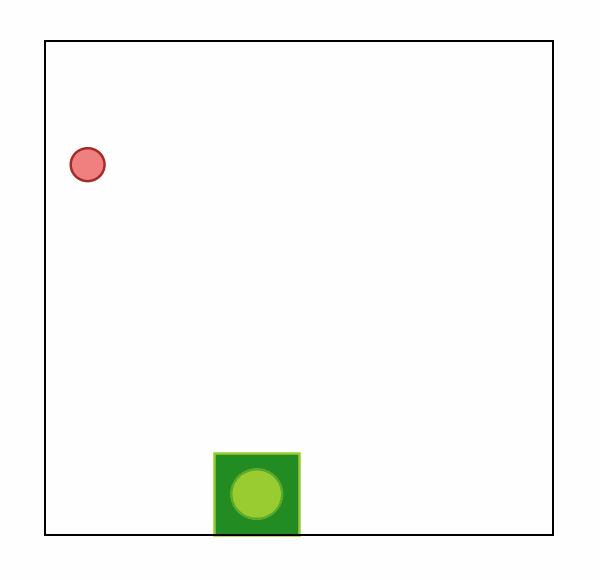

<p align="center">
    <a href="docs/img/jumanji_logo.png">
        
    </a>
</p>

[](https://www.python.org/doc/versions/)
[](https://badge.fury.io/py/jumanji)
[](https://github.com/instadeepai/jumanji/actions/workflows/tests_linters.yml)
[](https://github.com/psf/black)
[](http://mypy-lang.org/)
[](https://opensource.org/licenses/Apache-2.0)

---
[**Installation**](#installation-)
| [**Quickstart**](#quickstart-)
| [**Examples**](#examples-%EF%B8%8F)
| [**Environments**](#environments-)
| [**Citation**](#citing-jumanji-%EF%B8%8F)
| [**See Also**](#see-also)
| [**Reference Docs**](https://instadeepai.github.io/jumanji)


<p float="left" align="center">
  
  
  
</p>


## Welcome to the Jungle! 🌴

Jumanji is a suite of Reinforcement Learning (RL) environments written in JAX providing clean, hardware-accelerated
environments for industry-driven research.

Jumanji is helping pioneer a new wave of hardware-accelerated research and development in the
field of RL. Jumanji's high-speed environments enable faster iteration and larger-scale experimentation
while simultaneously reducing complexity. Originating in the Research Team at [InstaDeep](https://www.instadeep.com/),
Jumanji is now developed jointly with the open-source community.
To join us in these efforts, reach out, raise issues and read our [contribution guidelines](#contributing-) (or just star 🌟 to stay up to date with the latest developments)!

### Goals 🚀

1. Provide a simple, well-tested API for JAX-based environments.
2. Make research in RL more accessible.
3. Facilitate the research on RL for problems in the industry and
help close the gap between research and industrial applications.

### Overview 🦜

- 🥑 **Environment API**: core abstractions for JAX-based environments and their variations, e.g. multi-agent or turn-by-turn.
- 🕹️ **Environment Suite**: a list of RL environments ranging from simple games to complex NP-hard problems.
- 🍬 **Wrappers**: easily connect to your favourite RL frameworks and libraries such as [Acme](https://github.com/deepmind/acme), [Stable Baselines3](https://github.com/DLR-RM/stable-baselines3), [RLlib](https://docs.ray.io/en/latest/rllib/index.html), [OpenAI Gym](https://github.com/openai/gym), and [DeepMind-Env](https://github.com/deepmind/dm_env).
- 🎓 **Educational Examples and User Guides**: guides to facilitate Jumanji's adoption and highlight the added value of JAX-based environments.

## Installation 🎬

You can install the latest release of Jumanji from PyPI:
```bash
pip install jumanji
```
or you can install the latest development version directly from GitHub:
```bash
pip install git+https://github.com/instadeepai/jumanji.git
```
Jumanji has been tested on Python 3.7, 3.8 and 3.9.
Note that because the installation of JAX differs depending on your hardware accelerator,
we advise users to explicitly install the correct JAX version (see the [official installation guide](https://github.com/google/jax#installation)).

**Rendering:** Matplotlib is used for rendering the `BinPack` and `Snake` environments.
To visualize the environments you will need a GUI backend.
For example, on Linux, you can install Tk via: `apt-get install python3-tk`, or using conda: `conda install tk`.
Check out [Matplotlib backends](https://matplotlib.org/stable/users/explain/backends.html) for a list of backends you could use.

## Quickstart ⚡

Practitioners will find Jumanji's interface familiar
as it combines the widely adopted [OpenAI Gym](https://github.com/openai/gym)
and [DeepMind Environment](https://github.com/deepmind/dm_env) interfaces.
From OpenAI Gym, we adopted the idea of a `registry` and the `render` method,
while our `TimeStep` structure is inspired by `dm_env.TimeStep`.

### Basic Usage 🧑‍💻

```python
import jax
import jumanji

# Instantiate a Jumanji environment using the registry
env = jumanji.make('Snake-6x6-v0')

# Reset your (jit-able) environment
key = jax.random.PRNGKey(0)
state, timestep = jax.jit(env.reset)(key)

# (Optional) Render the env state
env.render(state)

# Interact with the (jit-able) environment
action = env.action_spec().generate_value()          # Action selection (dummy value here)
state, timestep = jax.jit(env.step)(state, action)   # Take a step and observe the next state and time step
```
where:

- `state` represents the internal state of an environment: it contains all the information required
to take a step when executing an action. This should **not** be confused with the `observation` contained in the `timestep`,
which is the information perceived by the agent.
- `timestep` is a dataclass containing `step_type`, `reward`, `discount`, `observation`, and `extras`.
This structure is similar to [`dm_env.TimeStep`](https://github.com/deepmind/dm_env/blob/master/docs/index.md)
except for the `extras` field that was added to allow users to retrieve information that is neither
part of the agent's observation nor part of the environment's internal state.

### Advanced Usage 🧑‍🔬
Being written in JAX, Jumanji's environments benefit from many of its features including
automatic vectorization/parallelization (`jax.vmap`, `jax.pmap`) and JIT-compilation (`jax.jit`),
which can be composed arbitrarily.
We provide an example of this below, where we use `jax.vmap` and `jax.lax.scan` to generate a batch
of rollouts in the `Snake` environment.

```python
import jax

import jumanji
from jumanji.wrappers import AutoResetWrapper

env = jumanji.make("Snake-6x6-v0")  # Creates the snake environment.
env = AutoResetWrapper(env)         # Automatically reset the environment when an episode terminates.

batch_size, rollout_length = 7, 5
num_actions = env.action_spec().num_values

random_key = jax.random.PRNGKey(0)
key1, key2 = jax.random.split(random_key)

def step_fn(state, key):
  action = jax.random.randint(key=key, minval=0, maxval=num_actions, shape=())
  new_state, timestep = env.step(state, action)
  return new_state, timestep

def run_n_step(state, key, n):
  random_keys = jax.random.split(key, n)
  state, rollout = jax.lax.scan(step_fn, state, random_keys)
  return rollout

# Instantiate a batch of environment states
keys = jax.random.split(key1, batch_size)
state, timestep = jax.vmap(env.reset)(keys)

# Collect a batch of rollouts
keys = jax.random.split(key2, batch_size)
rollout = jax.vmap(run_n_step, in_axes=(0, 0, None))(state, keys, rollout_length)

# Shape and type of given rollout:
# TimeStep(step_type=(7, 5), reward=(7, 5), discount=(7, 5), observation=(7, 5, 6, 6, 5), extras=None)
```

## Examples 🕹️

For more in-depth examples of running with Jumanji environments, check out our Colab notebooks:

| Example           | Topic          | Colab |
|-------------------|----------------|:-----:|
| Online Q-Learning | RL Training ([Anakin](https://arxiv.org/abs/2104.06272)) | <a href="https://colab.research.google.com/github/instadeepai/jumanji/blob/main/examples/anakin_snake.ipynb" target="_parent"></a>    |


## Environments 🌍

Jumanji implements different types of environments ranging from simple games to NP-hard problems,
from single-agent to multi-agent and turn-by-turn games.

| Environment                                    | Category      | Type         | Source                                                                                               | Description                                                         |
|------------------------------------------------|---------------|--------------|------------------------------------------------------------------------------------------------------|---------------------------------------------------------------------|
| 🐍 Snake                                       | Game          | Single-agent | [code](https://github.com/instadeepai/jumanji/tree/main/jumanji/environments/games/snake)            | [doc](https://instadeepai.github.io/jumanji/environments/snake/)    |
| 4️⃣ Connect4                                   | Game          | Turn-by-turn | [code](https://github.com/instadeepai/jumanji/tree/main/jumanji/environments/games/connect4)         | [doc](https://instadeepai.github.io/jumanji/environments/connect4/) |
| 📬 TSP (Travelling Salesman Problem)           | Combinatorial | Single-agent | [code](https://github.com/instadeepai/jumanji/tree/main/jumanji/environments/combinatorial/tsp)      | [doc](https://instadeepai.github.io/jumanji/environments/tsp/)      |
| 🎒 Knapsack                                    | Combinatorial | Single-agent | [code](https://github.com/instadeepai/jumanji/tree/main/jumanji/environments/combinatorial/knapsack) | [doc](https://instadeepai.github.io/jumanji/environments/knapsack/) |
| 🪢 Routing                                     | Combinatorial | Multi-agent  | [code](https://github.com/instadeepai/jumanji/tree/main/jumanji/environments/combinatorial/routing)  | [doc](https://instadeepai.github.io/jumanji/environments/routing/)  |
| 📦 BinPack (3D BinPacking Problem)             | Combinatorial | Single-agent | [code](https://github.com/instadeepai/jumanji/tree/main/jumanji/environments/combinatorial/binpack)  | [doc](https://instadeepai.github.io/jumanji/environments/binpack/)  |
| 🚚 CVRP (Capacitated Vehicle Routing Problem)  | Combinatorial | Single-agent | [code](https://github.com/instadeepai/jumanji/tree/main/jumanji/environments/combinatorial/cvrp)     | [doc](https://instadeepai.github.io/jumanji/environments/cvrp/)     |


### Registry and Versioning 📖

Similarly to OpenAI Gym, Jumanji keeps a strict versioning of its environments for reproducibility reasons.
We maintain a registry of standard environments with their configuration.
For each environment, a version suffix is appended, e.g. `Snake-6x6-v0`.
When changes are made to environments that might impact learning results,
the version number is incremented by one to prevent potential confusion.
For a full list of registered versions of each environment, check out [the documentation](https://instadeepai.github.io/jumanji/environments/tsp/).

## Contributing 🤝
Contributions are welcome! See our issue tracker for [good first issues](https://github.com/instadeepai/jumanji/labels/good%20first%20issue).
Please read our [contributing guidelines](./CONTRIBUTING.md) for details on
how to submit pull requests, our Contributor License Agreement, and community guidelines.

## Citing Jumanji ✏️
If you use Jumanji in your work, please cite the library using:
```
@software{jumanji2022github,
  author = {Clément Bonnet and Donal Byrne and Victor Le and Laurence Midgley
        and Daniel Luo and Cemlyn Waters and Sasha Abramowitz and Edan Toledo
        and Cyprien Courtot and Matthew Morris and Daniel Furelos-Blanco
        and Nathan Grinsztajn and Thomas D. Barrett and Alexandre Laterre},
  title = {Jumanji: Industry-Driven Hardware-Accelerated RL Environments},
  url = {https://github.com/instadeepai/jumanji},
  version = {0.1.4},
  year = {2022},
}
```

## See Also
Other works have embraced the approach of writing RL environments in JAX.
In particular, we suggest users check out the following sister repositories:

- 🦾 [Brax](https://github.com/google/brax) is a differentiable physics engine that simulates environments made up of rigid bodies, joints, and actuators.
- 🏋️‍ [Gymnax](https://github.com/RobertTLange/gymnax) implements classic environments including classic control, bsuite, MinAtar and a collection of meta RL tasks.
- 🌳 [Evojax](https://github.com/google/evojax) provides tools to enable neuroevolution algorithms to work with neural networks running across multiple TPU/GPUs.
- 🤖 [Qdax](https://github.com/adaptive-intelligent-robotics/QDax) is a library to accelerate Quality-Diversity and neuro-evolution algorithms through hardware accelerators and parallelization.

## Acknowledgements 🙏

The development of this library was supported with Cloud TPUs
from Google's [TPU Research Cloud](https://sites.research.google/trc/about/) (TRC) 🌤.
