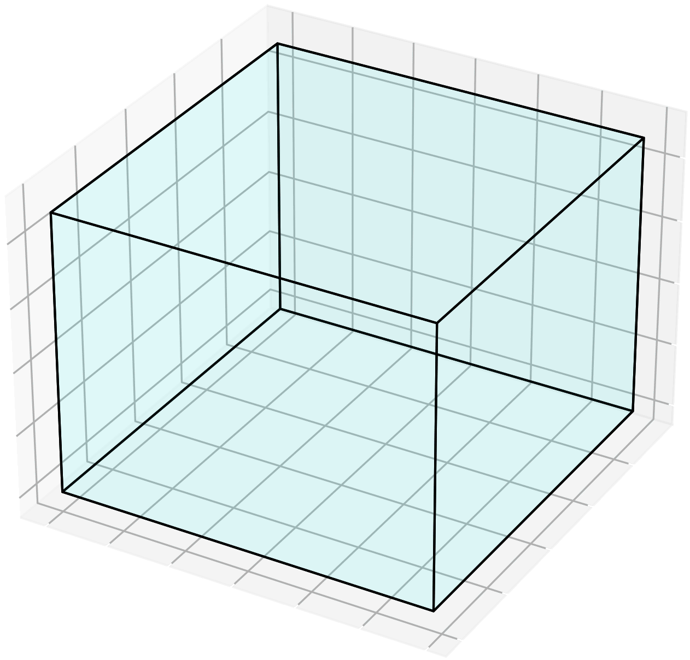
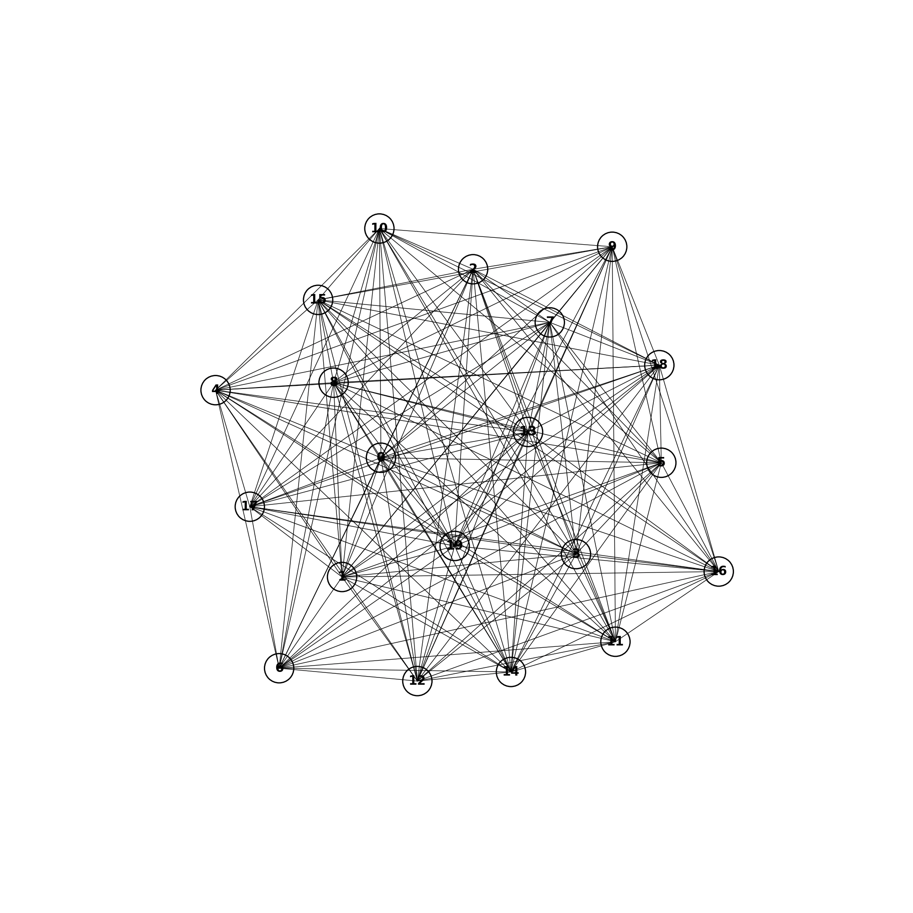
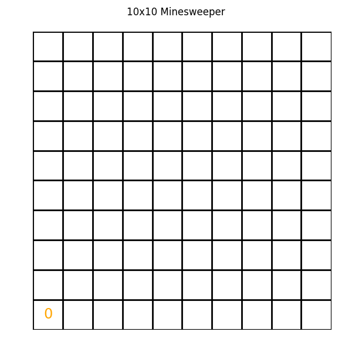
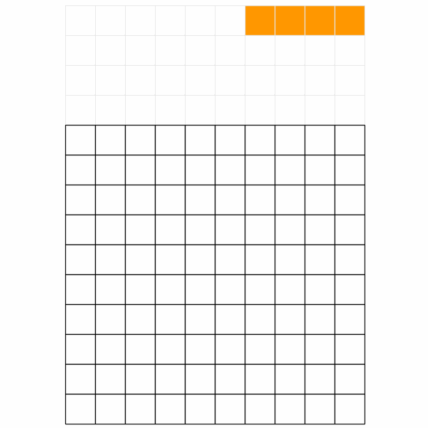

<p align="center">
    <a href="docs/img/jumanji_logo.png">
        
    </a>
</p>

[](https://www.python.org/doc/versions/)
[](https://badge.fury.io/py/jumanji)
[](https://github.com/instadeepai/jumanji/actions/workflows/tests_linters.yml)
[](https://github.com/psf/black)
[](http://mypy-lang.org/)
[](https://opensource.org/licenses/Apache-2.0)
[](https://huggingface.co/InstaDeepAI)

[**Environments**](#environments-)
| [**Installation**](#installation-)
| [**Quickstart**](#quickstart-)
| [**Training**](#training-%EF%B8%8F)
| [**Citation**](#citing-jumanji-%EF%B8%8F)
| [**Docs**](https://instadeepai.github.io/jumanji)
---

<div class="collage">
  <div class="row" align="center">
    
    
    
    
    
    
  </div>
  <div class="row" align="center">
    
    
    
    
    
    
  </div>
  <div class="row" align="center">
    
    
    
    
    
    
  </div>
</div>


## Welcome to the Jungle! 🌴

Jumanji is a diverse suite of scalable reinforcement learning environments written in JAX.

Jumanji is helping pioneer a new wave of hardware-accelerated research and development in the
field of RL. Jumanji's high-speed environments enable faster iteration and large-scale
experimentation while simultaneously reducing complexity. Originating in the Research Team at
[InstaDeep](https://www.instadeep.com/), Jumanji is now developed jointly with the open-source
community. To join us in these efforts, reach out, raise issues and read our
[contribution guidelines](https://github.com/instadeepai/jumanji/blob/main/CONTRIBUTING.md) or just
[star](https://github.com/instadeepai/jumanji) 🌟 to stay up to date with the latest developments!

### Goals 🚀

1. Provide a simple, well-tested API for JAX-based environments.
2. Make research in RL more accessible.
3. Facilitate the research on RL for problems in the industry and help close the gap between
research and industrial applications.
4. Provide environments whose difficulty can be scaled to be arbitrarily hard.

### Overview 🦜

- 🥑 **Environment API**: core abstractions for JAX-based environments.
- 🕹️ **Environment Suite**: a collection of RL environments ranging from simple games to NP-hard
combinatorial problems.
- 🍬 **Wrappers**: easily connect to your favourite RL frameworks and libraries such as
[Acme](https://github.com/deepmind/acme),
[Stable Baselines3](https://github.com/DLR-RM/stable-baselines3),
[RLlib](https://docs.ray.io/en/latest/rllib/index.html), [OpenAI Gym](https://github.com/openai/gym)
and [DeepMind-Env](https://github.com/deepmind/dm_env) through our `dm_env` and `gym` wrappers.
- 🎓 **Examples**: guides to facilitate Jumanji's adoption and highlight the added value of
JAX-based environments.
- 🏎️ **Training:** example agents that can be used as inspiration for the agents one may implement
in their research.

## Environments 🌍

Jumanji provides a diverse range of environments ranging from simple games to NP-hard combinatorial
problems.

| Environment                              | Category | Registered Version(s)                                | Source                                                                                           | Description                                                            |
|------------------------------------------|----------|------------------------------------------------------|--------------------------------------------------------------------------------------------------|------------------------------------------------------------------------|
| 🔢 Game2048                              | Logic  | `Game2048-v1`                                        | [code](https://github.com/instadeepai/jumanji/tree/main/jumanji/environments/logic/game_2048/)   | [doc](https://instadeepai.github.io/jumanji/environments/game_2048/)   |
| 🎨 GraphColoring                              | Logic  | `GraphColoring-v0`                                   | [code](https://github.com/instadeepai/jumanji/tree/main/jumanji/environments/logic/graph_coloring/)   | [doc](https://instadeepai.github.io/jumanji/environments/graph_coloring/)   |
| 💣 Minesweeper                           | Logic    | `Minesweeper-v0`                                     | [code](https://github.com/instadeepai/jumanji/tree/main/jumanji/environments/logic/minesweeper/) | [doc](https://instadeepai.github.io/jumanji/environments/minesweeper/) |
| 🎲 RubiksCube                            | Logic    | `RubiksCube-v0`<br/>`RubiksCube-partly-scrambled-v0` | [code](https://github.com/instadeepai/jumanji/tree/main/jumanji/environments/logic/rubiks_cube/) | [doc](https://instadeepai.github.io/jumanji/environments/rubiks_cube/) |
| ✏️ Sudoku                       | Logic    | `Sudoku-v0` <br/>`Sudoku-very-easy-v0`               | [code](https://github.com/instadeepai/jumanji/tree/main/jumanji/environments/logic/sudoku/) | [doc](https://instadeepai.github.io/jumanji/environments/sudoku/) |
| 📦 BinPack (3D BinPacking Problem)       | Packing  | `BinPack-v2`                                         | [code](https://github.com/instadeepai/jumanji/tree/main/jumanji/environments/packing/bin_pack/)  | [doc](https://instadeepai.github.io/jumanji/environments/bin_pack/)    |
| 🏭 JobShop (Job Shop Scheduling Problem) | Packing  | `JobShop-v0`                                         | [code](https://github.com/instadeepai/jumanji/tree/main/jumanji/environments/packing/job_shop/)  | [doc](https://instadeepai.github.io/jumanji/environments/job_shop/)    |
| 🎒 Knapsack                              | Packing  | `Knapsack-v1`                                        | [code](https://github.com/instadeepai/jumanji/tree/main/jumanji/environments/packing/knapsack/)  | [doc](https://instadeepai.github.io/jumanji/environments/knapsack/)    |
| ▒ Tetris                              | Packing  | `Tetris-v0`                                        | [code](https://github.com/instadeepai/jumanji/tree/main/jumanji/environments/packing/tetris/)  | [doc](https://instadeepai.github.io/jumanji/environments/tetris/)    |
| 🧹 Cleaner                               | Routing  | `Cleaner-v0`                                         | [code](https://github.com/instadeepai/jumanji/tree/main/jumanji/environments/routing/cleaner/)   | [doc](https://instadeepai.github.io/jumanji/environments/cleaner/)     |
| :link: Connector                         | Routing  | `Connector-v2`                                       | [code](https://github.com/instadeepai/jumanji/tree/main/jumanji/environments/routing/connector/) | [doc](https://instadeepai.github.io/jumanji/environments/connector/)   |
| 🚚 CVRP (Capacitated Vehicle Routing Problem)  | Routing  | `CVRP-v1`                                            | [code](https://github.com/instadeepai/jumanji/tree/main/jumanji/environments/routing/cvrp/)      | [doc](https://instadeepai.github.io/jumanji/environments/cvrp/)        |
| 🚚 MultiCVRP (Multi-Agent Capacitated Vehicle Routing Problem)  | Routing  | `MultiCVRP-v0`                                            | [code](https://github.com/instadeepai/jumanji/tree/main/jumanji/environments/routing/multi_cvrp/)      | [doc](https://instadeepai.github.io/jumanji/environments/multi_cvrp/)        |
| :mag: Maze   | Routing  | `Maze-v0`                                            | [code](https://github.com/instadeepai/jumanji/tree/main/jumanji/environments/routing/maze/)      | [doc](https://instadeepai.github.io/jumanji/environments/maze/)        |
| :robot: RobotWarehouse  | Routing  | `RobotWarehouse-v0`                                  | [code](https://github.com/instadeepai/jumanji/tree/main/jumanji/environments/routing/robot_warehouse/)      | [doc](https://instadeepai.github.io/jumanji/environments/robot_warehouse/)        |
| 🐍 Snake                                       | Routing  | `Snake-v1`                                           | [code](https://github.com/instadeepai/jumanji/tree/main/jumanji/environments/routing/snake/)     | [doc](https://instadeepai.github.io/jumanji/environments/snake/)       |
| 📬 TSP (Travelling Salesman Problem)           | Routing  | `TSP-v1`                                             | [code](https://github.com/instadeepai/jumanji/tree/main/jumanji/environments/routing/tsp/)       | [doc](https://instadeepai.github.io/jumanji/environments/tsp/)         |
| Multi Minimum Spanning Tree Problem | Routing  | `MMST-v0`                                | [code](https://github.com/instadeepai/jumanji/tree/main/jumanji/environments/routing/mmst)    | [doc](https://instadeepai.github.io/jumanji/environments/mmst/)    |

## Installation 🎬

You can install the latest release of Jumanji from PyPI:

```bash
pip install jumanji
```

Alternatively, you can install the latest development version directly from GitHub:

```bash
pip install git+https://github.com/instadeepai/jumanji.git
```

Jumanji has been tested on Python 3.8 and 3.9.
Note that because the installation of JAX differs depending on your hardware accelerator,
we advise users to explicitly install the correct JAX version (see the
[official installation guide](https://github.com/google/jax#installation)).

**Rendering:** Matplotlib is used for rendering all the environments. To visualize the environments
you will need a GUI backend. For example, on Linux, you can install Tk via:
`apt-get install python3-tk`, or using conda: `conda install tk`. Check out
[Matplotlib backends](https://matplotlib.org/stable/users/explain/backends.html) for a list of
backends you can use.

## Quickstart ⚡

RL practitioners will find Jumanji's interface familiar as it combines the widely adopted
[OpenAI Gym](https://github.com/openai/gym) and
[DeepMind Environment](https://github.com/deepmind/dm_env) interfaces. From OpenAI Gym, we adopted
the idea of a `registry` and the `render` method, while our `TimeStep` structure is inspired by
DeepMind Environment.

### Basic Usage 🧑‍💻

```python
import jax
import jumanji

# Instantiate a Jumanji environment using the registry
env = jumanji.make('Snake-v1')

# Reset your (jit-able) environment
key = jax.random.PRNGKey(0)
state, timestep = jax.jit(env.reset)(key)

# (Optional) Render the env state
env.render(state)

# Interact with the (jit-able) environment
action = env.action_spec().generate_value()          # Action selection (dummy value here)
state, timestep = jax.jit(env.step)(state, action)   # Take a step and observe the next state and time step
```

- `state` represents the internal state of the environment: it contains all the information required
to take a step when executing an action. This should **not** be confused with the `observation`
contained in the `timestep`, which is the information perceived by the agent.
- `timestep` is a dataclass containing `step_type`, `reward`, `discount`, `observation` and
`extras`. This structure is similar to
[`dm_env.TimeStep`](https://github.com/deepmind/dm_env/blob/master/docs/index.md) except for the
`extras` field that was added to allow users to log environments metrics that are neither part of
the agent's observation nor part of the environment's internal state.

### Advanced Usage 🧑‍🔬

Being written in JAX, Jumanji's environments benefit from many of its features including
automatic vectorization/parallelization (`jax.vmap`, `jax.pmap`) and JIT-compilation (`jax.jit`),
which can be composed arbitrarily.
We provide an example of a more advanced usage in the
[advanced usage guide](https://instadeepai.github.io/jumanji/guides/advanced_usage/).

### Registry and Versioning 📖

Like OpenAI Gym, Jumanji keeps a strict versioning of its environments for reproducibility reasons.
We maintain a registry of standard environments with their configuration.
For each environment, a version suffix is appended, e.g. `Snake-v1`.
When changes are made to environments that might impact learning results,
the version number is incremented by one to prevent potential confusion.
For a full list of registered versions of each environment, check out
[the documentation](https://instadeepai.github.io/jumanji/environments/tsp/).

## Training 🏎️

To showcase how to train RL agents on Jumanji environments, we provide a random agent and a vanilla
actor-critic (A2C) agent. These agents can be found in
[jumanji/training/](https://github.com/instadeepai/jumanji/tree/main/jumanji/training/).

Because the environment framework in Jumanji is so flexible, it allows pretty much any problem to
be implemented as a Jumanji environment, giving rise to very diverse observations. For this reason,
environment-specific networks are required to capture the symmetries of each environment.
Alongside the A2C agent implementation, we provide examples of such environment-specific
actor-critic networks in
[jumanji/training/networks](https://github.com/instadeepai/jumanji/tree/main/jumanji/training/networks/).

> ⚠️ The example agents in `jumanji/training` are **only** meant to serve as inspiration for how one
> can implement an agent. Jumanji is first and foremost a library of environments - as such, the
> agents and networks will **not** be maintained to a production standard.

For more information on how to use the example agents, see the
[training guide](https://instadeepai.github.io/jumanji/guides/training/).

## Contributing 🤝

Contributions are welcome! See our issue tracker for
[good first issues](https://github.com/instadeepai/jumanji/labels/good%20first%20issue). Please read
our [contributing guidelines](https://github.com/instadeepai/jumanji/blob/main/CONTRIBUTING.md) for
details on how to submit pull requests, our Contributor License Agreement, and community guidelines.

## Citing Jumanji ✏️

If you use Jumanji in your work, please cite the library using:

```
@software{jumanji2023github,
  author = {Clément Bonnet and Daniel Luo and Donal Byrne and Sasha Abramowitz
        and Vincent Coyette and Paul Duckworth and Daniel Furelos-Blanco and
        Nathan Grinsztajn and Tristan Kalloniatis and Victor Le and Omayma Mahjoub
        and Laurence Midgley and Shikha Surana and Cemlyn Waters and Alexandre Laterre},
  title = {Jumanji: a Suite of Diverse and Challenging Reinforcement Learning Environments in JAX},
  url = {https://github.com/instadeepai/jumanji},
  version = {0.2.2},
  year = {2023},
}
```

## See Also 🔎

Other works have embraced the approach of writing RL environments in JAX.
In particular, we suggest users check out the following sister repositories:

- 🤖 [Qdax](https://github.com/adaptive-intelligent-robotics/QDax) is a library to accelerate
Quality-Diversity and neuro-evolution algorithms through hardware accelerators and parallelization.
- 🌳 [Evojax](https://github.com/google/evojax) provides tools to enable neuroevolution algorithms
to work with neural networks running across multiple TPU/GPUs.
- 🦾 [Brax](https://github.com/google/brax) is a differentiable physics engine that simulates
environments made up of rigid bodies, joints, and actuators.
- 🏋️‍ [Gymnax](https://github.com/RobertTLange/gymnax) implements classic environments including
classic control, bsuite, MinAtar and a collection of meta RL tasks.
- 🎲 [Pgx](https://github.com/sotetsuk/pgx) provides classic board game environments like
Backgammon, Shogi, and Go.

## Acknowledgements 🙏

The development of this library was supported with Cloud TPUs
from Google's [TPU Research Cloud](https://sites.research.google/trc/about/) (TRC) 🌤.
