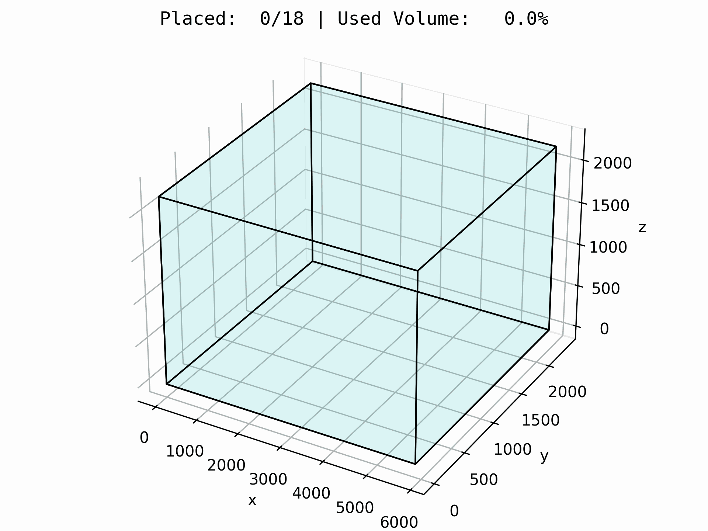

# BinPack Environment

<p align="center">
        
</p>

We provide here an implementation of the 3D [bin packing problem](https://en.wikipedia.org/wiki/Bin_packing_problem). In this problem, the goal of the agent is to efficiently pack a set of boxes of different sizes into a single container with
as little empty space as possible.

## Observation
The observation given to the agent provides information on the available empty space, the items that
still need to be packed, and information on what actions are legal at this point. The full observation
spec is as follows:

```
Observation:
    ems: EMS(Empty Maximal Space)
    ems_mask: chex.Array
    items: Item
    items_mask: chex.Array
    items_placed: chex.Array
    action_mask: chex.Array
```
where

- `ems` is the **empty maximal space (EMS)**, which specifies the space that can contain an `Item`.
It is defined by a pair of points in 3D space `(x1, x2, y1, y2, z1, z2)` and has the shape `(obs_num_ems,)`.
- `ems_mask` is `True` if `ems` exists. It has shape `(obs_num_ems,)`.
- `items` is defined by `(x_len, y_len, z_len)` and has shape `(max_num_items,)`.
- `items_mask` is `True` if `items` exist. It has shape `(max_num_items,)`.
- `items_placed` is  `True` if items are placed in the container. It has shape `(max_num_items,)`.
- `action_mask` is the joint action mask specifying which actions are valid. It has shape `(obs_num_ems, max_num_items)`.

## Actions
At each step in the environment, the agent must provide an action specifying 2 integers:
- The ID of the `Item` that will be placed in the container.
- The ID of the `EMS` that the `Item` will be placed in.

Actions taken in the `BinPack` environment follow the rules:

- **Placement**: the chosen item will be placed in the *bottom left corner* of the chosen space.
- **Support**: an item can be placed only in an `EMS`. These spaces are defined to have a
non-zero support with an item below or a container surface. Since the item is placed in the corner,
the support could end up being null. Hence, the item could technically fall to the side or down
below but the environment keeps it in the corner of the `EMS` for the sake of simplicity.
- **Gravity**: there is no gravity enforced.

**Note**: not all actions are allowed at each time step, for example you cannot place an item in a
space that already contains an item. To avoid taking illegal actions, you should always use the
`action_mask` contained in the observation.

```python
#TODO - action example
```

```
action: jax array of shape (2,) # (ems_id, item_id)
```

## Reward
At the end of the episode, the reward is calculated by penalizing the agent for any remaining space
in the container: `reward = volume_utilization - 1.0`.
For example, if the container is 80% full at the end of the episode, the agent will receive
a reward of `-0.20`. Unless it is a terminal state, each step in the episode returns
a reward of `0.0`.

```
reward: jax array of shape() # [-1, 0]
```

## Registered Versions 📖
- `BinPack-toy-v0`, a fixed problem instance containing 20 items to pack in a 20ft container.
- `BinPack-rand20-v0`, randomly generated instances containing 20 items.
- `BinPack-rand40-v0`, randomly generated instances containing 40 items.
- `BinPack-rand100-v0`, randomly generated instances containing 100 items.
