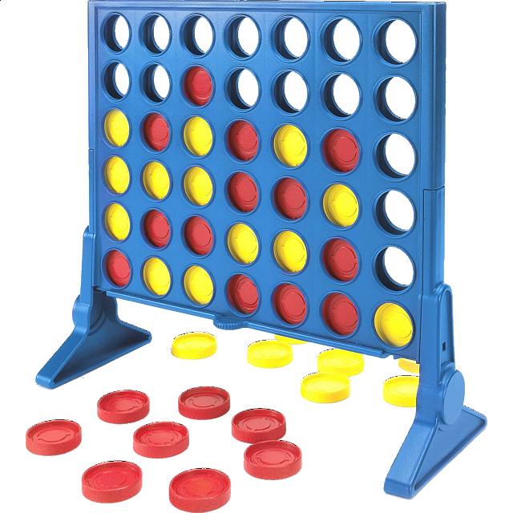

# Connect4 Environment

        

We provide here a Jax JIT-able implementation of the _Connect Four_ game. The environment contains
two agents competing against each other, playing turn by turn. The goal of each agent is to win by connecting 4 tokens horizontally, vertically or diagonally.
The board is 6 rows by 7 columns.

## Observation
The observation is a dataclass containing a view of the board from the point of view of the current
player and a mask indicating valid actions.

## Action
There are 7 possible actions, each representing which column to insert the token into (recall that the board is 6 rows by 7 columns): `0, 1, 2, 3, 4, 5, 6`.

## Reward
If the board gets full before any of the two agents connects 4, the game is a draw and the
reward is 0 for both players. If an agent makes an invalid move, they lose instantly.
The reward for winning is `+1` and the reward for losing is `-1`.

## Registered Versions 📖
- `Connect4-v0`, the classic [Connect4](https://en.wikipedia.org/wiki/Connect_Four) game.
