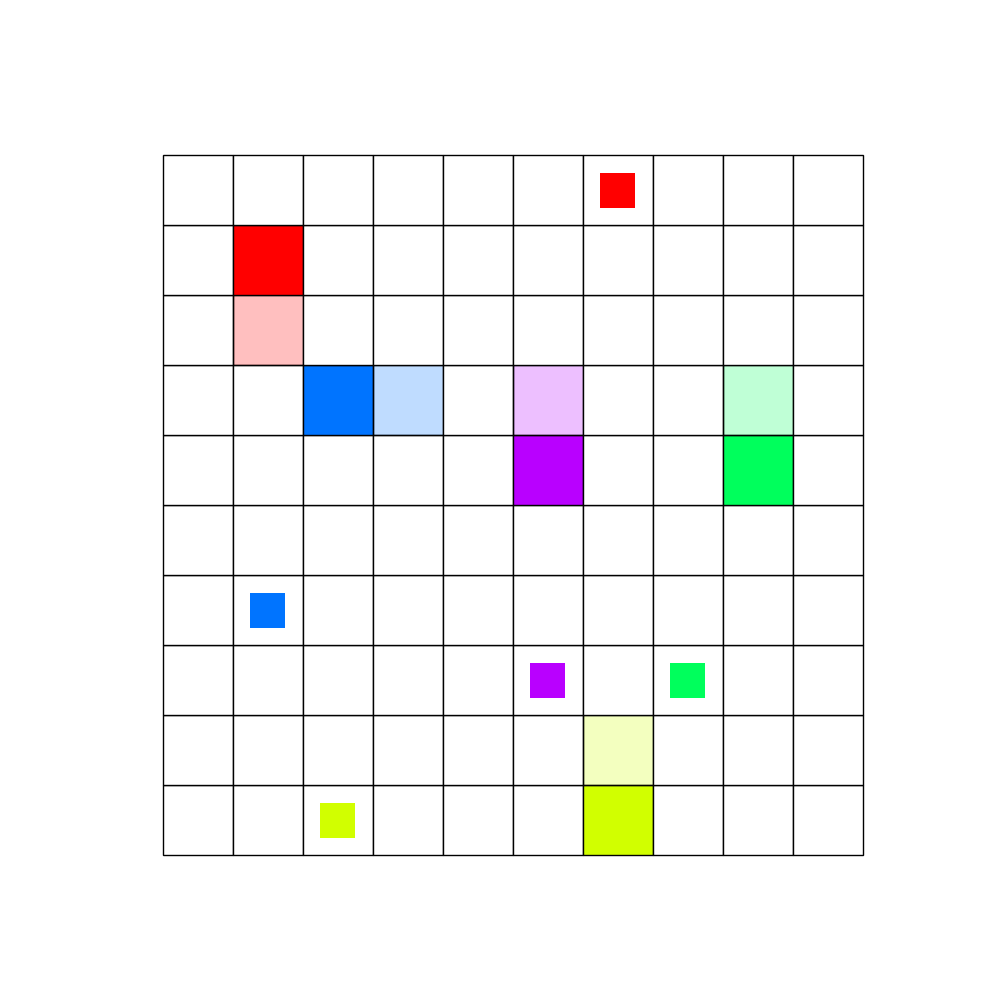

# Connector Environment

<p align="center">
        
</p>

The `Connector` environment contains multiple agents spawned in a grid world with each agent
representing a start and end position that need to be connected. The main goal of the environment
is to connect each start and end position in as few steps as possible. However, when an agent moves
it leaves behind a path, which is impassable by all agents. Thus, agents need to cooperate in order
to allow each other to connect to their own targets without overlapping.

An episode ends when all agents have connected to their targets or no agents can make any further
moves due to being blocked.

## Observation
At each step observation contains 3 items: a grid, an action mask for each agent and
the episode step count.

- `grid`: jax array (int32) of shape `(grid_size, grid_size)`, a 2D matrix for each
   agent that represents pairs of points that need to be connected. Each agent has three types of
   points: **position**, **target** and **path** which are represented by different numbers on the
   grid. The **position** of an agent has to connect to its **target**, leaving a **path** behind
   it as it moves across the grid forming its route. Each agent connects to only 1 target.

- `action_mask`: jax array (bool) of shape `(num_agents, 5)`, indicates which actions each agent
   can take.

- `step_count`: jax array (int32) of shape `()`, represents how many steps have been taken in
   the environment since the last reset.


### Encoding
Each agent has 3 components represented in the observation space: **position**, **target**, and **path**. Each
agent in the environment will have an integer representing their components.

- Positions are encoded starting from 2 in multiples of 3: 2, 5, 8, …

- Targets are encoded starting from 3 in multiples of 3: 3, 6, 9, …

- Paths appear in the location of the head once it moves, starting from 1 in multiples of 3: 1, 4, 7, …

Every group of 3 corresponds to 1 agent: (1,2,3), (4,5,6), …

Example:
```
Agent1[path=1, position=2, target=3]
Agent2[path=4, position=5, target=6]
Agent3[path=7, position=8, target=9]
```

For example, on a 6x6 grid, a possible observation is shown below.

```
[[ 2  0  3  0  0  0]
 [ 1  0  4  4  4  0]
 [ 1  0  5  9  0  0]
 [ 1  0  0  0  0  0]
 [ 0  0  0  8  0  0]
 [ 0  0  6  7  7  7]]
```

## Action
The action space is a `MultiDiscreteArray` of shape `(num_agents,)` of integer values in the range
of `[0, 4]`. Each value corresponds to an agent moving in 1 of 4 cardinal directions or taking the
no-op action. That is, [0, 1, 2, 3, 4] -> [No Op, Up, Right, Down, Left].


## Reward
The reward is **dense**: +1.0 per agent that connects at that step and -0.03 per agent that has not
connected yet.

Rewards are provided in the shape `(num_agents,)` so that each agent can have a reward.


## Registered Versions 📖
- `Connector-v0`, grid size of 10 and 5 agents.
