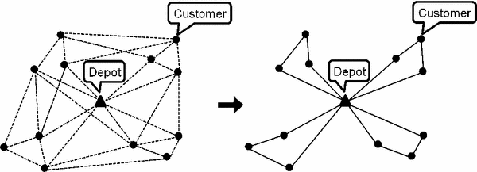

# Capacitated Vehicle Routing Problem (CVRP) Environment

<p align="center">
        
</p>

We provide here a Jax JIT-able implementation of the capacitated vehicle routing problem
(CVRP) which is a specific type of [VRP](https://en.wikipedia.org/wiki/Vehicle_routing_problem).


CVRP is a classic combinatorial optimization problem. Given a set of nodes with specific demands,
a depot node, and a vehicle with limited capacity, the goal is to determine the shortest route
between the nodes such that each node (excluding depot) is visited exactly once and has its demand
covered. The problem is NP-complete, thus there is no known algorithm both correct and fast 
(i.e., that runs in polynomial time) for any instance of the problem.

A new problem instance is generated by resetting the environment. The problem instance contains 
coordinates for each node sampled from a uniform distribution between 0 and 1, and each node
(except for depot) has a specific demand which is an integer value sampled from a uniform
distribution between 1 and the maximum demand (which is a parameter of the CVRP environment). 
The number of nodes with demand is a parameter of the environment.

## Observation
The observation given to the agent provides information on the problem layout, the visited/unvisited cities and
the current position of the agent as well as the current capacity.

**Observation Spec**:

- **coordinates**: jax array (float32) of shape (problem_size + 1, 2), shows an array of the coordinates of each city node 
and the depot node.
- **demands**: jax array (float32) of shape (problem_size + 1,), shows an array of the demands of each city node 
(and depot node where the demand is set to 0).
- **position**: jax array (int32), gives the identifier (index) of the current visited city or depot.
- **current capacity**: jax array (float32), gives the current capacity of the vehicle.
- **action_mask**: jax array (bool) of shape (problem_size + 1,), denoting which actions are possible (True) and 
which are not (False).

## Action
Action space is an `DiscreteArray` of size equal to the number of city nodes + 1 depot node. The 0th 
index corresponds to the depot node and the remaining indices correspond to the city nodes. A value
of 1 at an index indicates an action to visit the node corresponding to that index, 
a value of 0 indicates an action not to visit that node. 

```
action: [0, 0, 0, 1, 0]  # Problem size of 4 cities, choosing the 3rd city
```

## Reward
The reward is 0 at every step but the last, where the reward is
the negative of the length of the path chosen by the agent.

## Registered Versions 📖
- `CVRP20-v0`, CVRP problem with 20 nodes (randomly generated), maximum capacity of 30, and maximum demand of 10.
- `CVRP50-v0`, CVRP problem with 50 nodes (randomly generated), maximum capacity of 40, and maximum demand of 10.
- `CVRP100-v0`, CVRP problem with 100 nodes (randomly generated), maximum capacity of 50, and maximum demand of 10.
- `CVRP125-v0`, CVRP problem with 125 nodes (randomly generated), maximum capacity of 55, and maximum demand of 10.
- `CVRP150-v0`, CVRP problem with 150 nodes (randomly generated), maximum capacity of 60, and maximum demand of 10.
