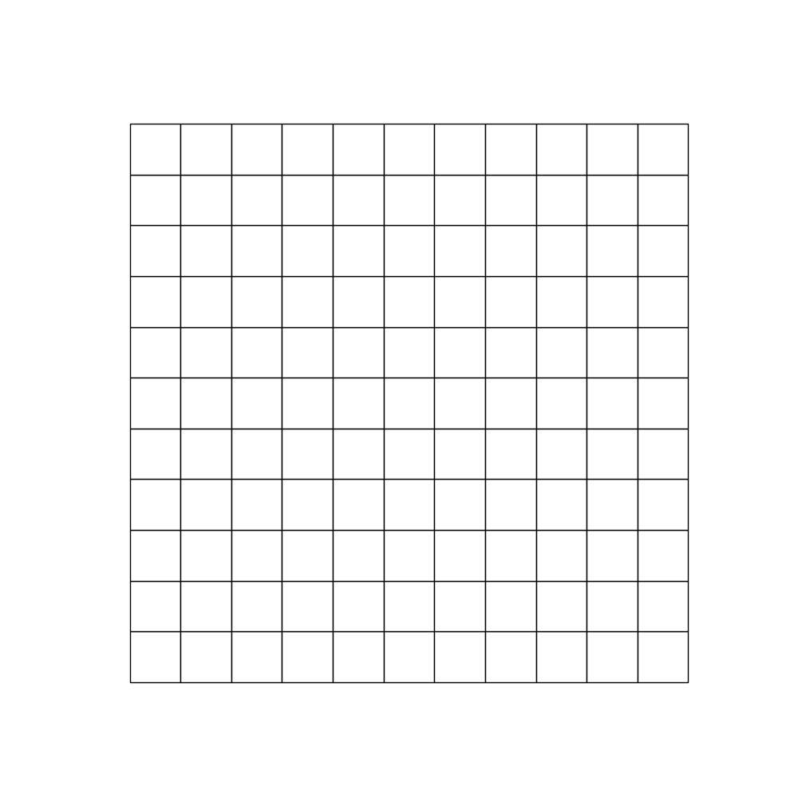

# FlatPack Environment

        

We provide here a Jax JIT-able implementation of a packing environment named _flat pack_. The goal of
the agent is to place all the available blocks on an empty 2D grid.
Each time an episode resets a new set of blocks is created and the grid is emptied. Blocks are randomly
shuffled and rotated.

## Observation
The observation given to the agent gives a view of the current state of the grid as well as
all blocks that can be placed.

- `current_grid`: jax array (float32) of shape `(num_rows, num_cols)` with values in the range
    `[0, num_blocks]` (corresponding to the number of each block). This grid will have zeros
    where no blocks have been placed and numbers corresponding to each block where that particular
    block has been placed.

- `blocks`: jax array (float32) of shape `(num_blocks, 3, 3)` of all possible blocks in the
    that can fit in the current grid. These blocks are shuffled, rotated and will always have shape `(3, 3)`.

- `action_mask`: jax array (bool) of shape `(num_blocks, 4, num_rows-2, num_cols-2)`, representing
    which actions are possible given the current state of the grid. The first index indicates the
    number of blocks associated with a given grid. The second index indicates the number of times a block may be rotated.
    The third and fourth indices indicate the row and column coordinate of where a block may be placed respectively.
    Blocks are placed by an agent by specifying the row and column coordinate on the grid where the top left corner
    of the selected block should be placed. These values will always be `num_rows-2` and `num_cols-2`
    respectively to make it impossible for an agent to place a block outside the current grid.

## Action
The action space is a `MultiDiscreteArray`, specifically a tuple of an index between 0 and `num_blocks`,
an index between 0 and 4 (since there are 4 possible rotations), an index between 0 and `num_rows-2`
(the possible row coordinates for placing a block) and an index between 0 and `num_cols-2`
(the possible column coordinates for placing a block). An action thus consists of four pieces of
information:

- Block to place,

- Number of 90 degree rotations to make to a chosen block ({0, 90, 180, 270} degrees),

- Row coordinate for placing the rotated block's top left corner,

- Column coordinate for placing the rotated block's top left corner.

## Reward
The reward function is configurable, but by default is a fully dense reward giving the sum of the number of non-zero
cells in a placed block normalised by the total number of cells in the grid at each timestep. The episode
terminates if either the grid is filled or `num_blocks` steps have been taken by an agent.

## Registered Versions 📖
- `FlatPack-v0`, a flat pack environment grid with 7 rows and 7 columns containing 3 row blocks and 3 column blocks
    for a total of 9 blocks that can be placed on the grid. This version has a dense reward.
