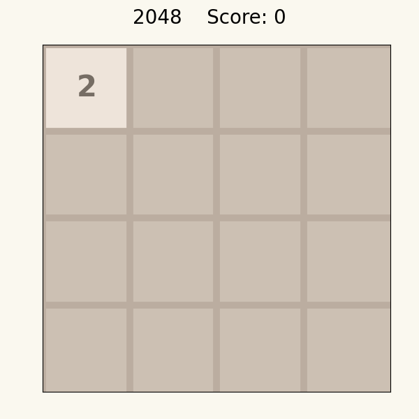

# 2048 Environment

<p align="center">
    
</p>

We provide here a Jax JIT-able implementation of the game [2048](https://play2048.co/).

2048 is a popular single-player puzzle game that is played on a 4x4 grid. The game board consists of cells, each containing a power of 2, and the objective is to reach a score of _at least_ 2048 by merging cells together. The player can shift the entire grid in one of the four directions (up, down, right, left) to combine cells of the same value. When two adjacent cells have the same value, they merge into a single cell with a value equal to the sum of the two cells. The game ends when the player is no longer able to make any further moves. The ultimate goal is to achieve the highest-valued tile possible, with the hope of surpassing 2048. With each move, the player must carefully plan and strategize to reach the highest score possible.


## Observation
The observation in the game 2048 includes information about the board, the action mask, and the step count.
- `board`: jax array (int32) of shape `(board_size, board_size)`, representing the current game state.
Each nonzero element in the array corresponds to a game tile and holds an exponent of 2.
The actual value of the tile is obtained by raising 2 to the power of said exponent.
    - Here is an example of a random observation of the game board:
        ```
        [[ 2 0 1 4]
         [ 5 3 0 2]
         [ 0 2 3 2]
         [ 1 2 0 0]]
        ```
    - This array can be converted into the actual game board:
        ```
        [[  4 0 2 16]
         [ 32 8 0  4]
         [  0 4 8  4]
         [  2 4 0  0]]
        ```
- `action_mask`: jax array (bool) of shape `(4,)`, indicating which actions are valid in the current state of the environment. The actions include moving the tiles up, right, down, or left.
For example, an action mask `[False, True, False, False]` means that the only valid action is to move the tiles rightward.


## Action
The action space is a `DiscreteArray` of integer values in `[0, 1, 2, 3]`. Specifically, these four actions
correspond to: up (0), right (1), down (2), or left (3).


## Reward
Taking an action in 2048 only returns a reward when two tiles of equal value are merged into a new tile
containing their sum (i.e. twice each of their values). The cumulative reward in an episode is the sum
of the values of all newly created tiles. For example, if a player merges two 512-value tiles to create
a new 1024-value tile, and then merges two 256-value tiles to create a new 512-value tile, the total reward
from these actions is 1536 (i.e., 1024 + 512).


## Registered Versions 📖
- `Game2048-v0`, the default settings for 2048 with a board of size 4x4.
