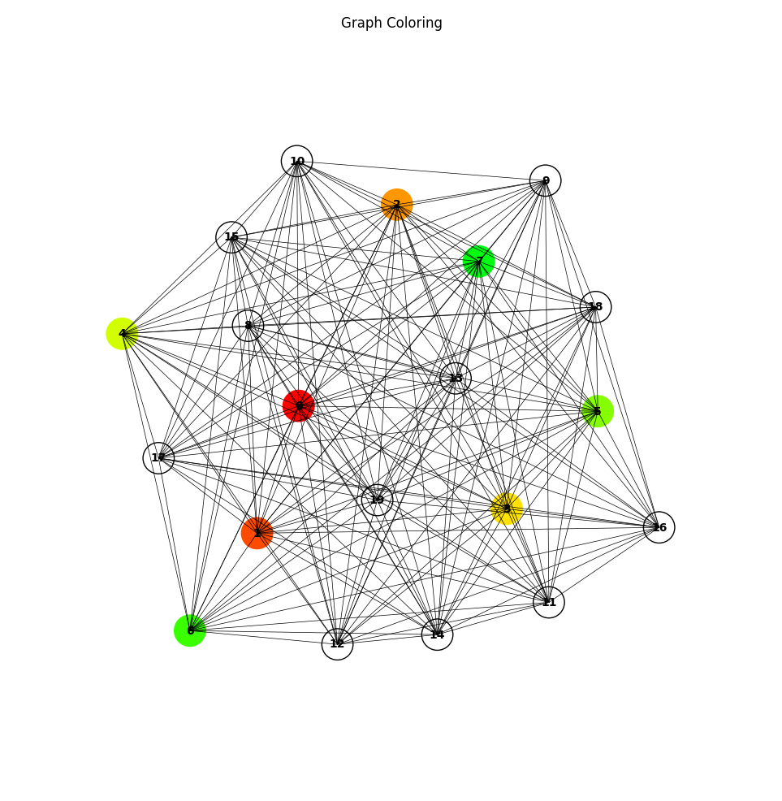

# Graph Coloring Environment

<p align="center">
    
</p>

We provide here a Jax JIT-able implementation of the Graph Coloring environment.

Graph coloring is a combinatorial optimization problem where the objective is to assign a color to each vertex of a graph in such a way that no two adjacent vertices share the same color. The problem is usually formulated as minimizing the number of colors used. The `GraphColoring` environment is an episodic, single-agent setting that allows for the exploration of graph coloring algorithms and reinforcement learning methods.

## Observation

The observation in the `GraphColoring` environment includes information about the graph, the colors assigned to the vertices, the action mask, and the current node index.

- `graph`: jax array (bool) of shape `(num_nodes, num_nodes)`, representing the adjacency matrix of the graph.
  - For example, a random observation of the graph adjacency matrix:

        ```[[False,  True, False,  True],
        [ True, False,  True, False],
        [False,  True, False,  True],
        [ True, False,  True, False]]```

- `colors`: a JAX array (int32) of shape `(num_nodes,)`, representing the current color assignments for the vertices. Initially, all elements are set to -1, indicating that no colors have been assigned yet.
  - For example, an initial color assignment:
    ```[-1, -1, -1, -1]```

- `action_mask`: a JAX array of boolean values, shaped `(num_colors,)`, which indicates the valid actions in the current state of the environment. Each position in the array corresponds to a color. True at a position signifies that the corresponding color can be used to color a node, while False indicates the opposite.
  - For example, for 4 number of colors available:
    ```[True, False, True, False]```

- `current_node_index`: an integer representing the current node being colored.
  - For example, an initial current_node_index might be 0.

## Action

The action space is a DiscreteArray of integer values in `[0, 1, ..., num_colors - 1]`. Each action corresponds to assigning a color to the current node.

## Reward

The reward in the `GraphColoring` environment is given as follows:

- `sparse reward`: a reward is provided at the end of the episode and equals the negative of the number of unique colors used to color all vertices in the graph.

The agent's goal is to find a valid coloring using as few colors as possible while avoiding conflicts with adjacent nodes.

## Episode Termination

The goal of the agent is to find a valid coloring using as few colors as possible. An episode in the graph coloring environment can terminate under two conditions:

1. All nodes have been assigned a color: the environment iteratively assigns colors to nodes. When all nodes have a color assigned (i.e., there are no nodes with a color value of -1), the episode ends. This is the natural termination condition and ideally the one we'd like the agent to achieve.

2. Invalid action is taken: an action is considered invalid if it tries to assign a color to a node that is not within the allowed color set for that node at that time. The allowed color set for each node is updated after every action. If an invalid action is attempted, the episode immediately terminates and the agent receives a large negative reward. This encourages the agent to learn valid actions and discourages it from making invalid actions.

## Registered Versions 📖

- `GraphColoring-v0`: The default settings for the `GraphColoring` problem with a configurable number of nodes and connectivity.
