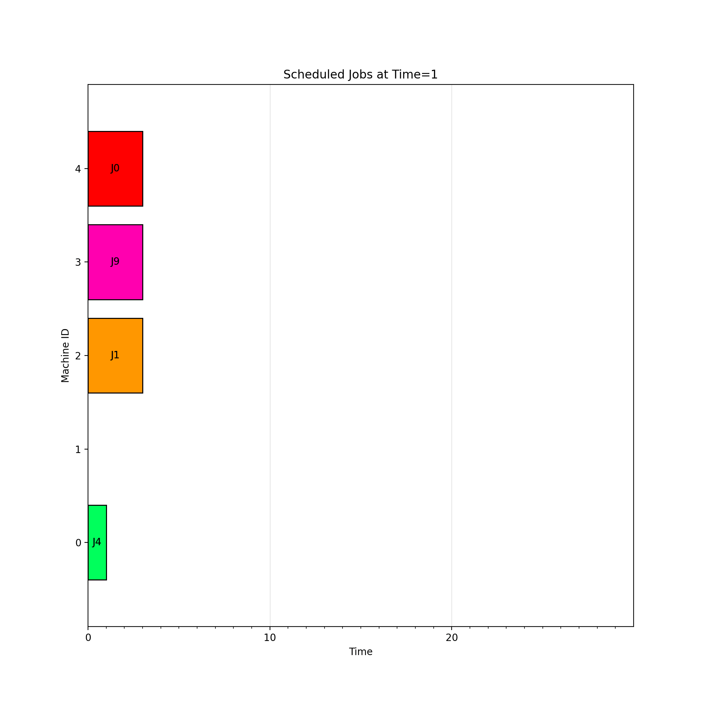

# JobShop Environment

<p align="center">
        
</p>

We provide here a JAX jit-able implementation of the
[job shop scheduling problem](https://developers.google.com/optimization/scheduling/job_shop).
It is NP-hard and one of the most well-known combinatorial optimisation problems. The problem
formulation is:

- `N` **jobs**, each consisting of a sequence of **operations**, need to be scheduled on `M`
machines.

- For each job, its operations must be processed **in order**. This is called the **precedence
constraints**.

- Only one operation in a job can be processed at any given time.

- A machine can only work on one operation at a time.

- Once started, an operation must run to completion.

The goal of the agent is to determine the schedule that minimises the time needed to process all
the jobs. The length of the schedule is also known as its _makespan_.


## Observation
The **observation** seen by the agent is a `NamedTuple` containing the following:

- `ops_machine_ids`: jax array (int32) of shape `(num_jobs, max_num_ops)`. For each job, it
    specifies the machine each op must be processed on. Note that a `-1` corresponds to padded ops
    since not all jobs have the same number of ops.

- `ops_durations`: jax array (int32) of shape `(num_jobs, max_num_ops)`. For each job, it specifies
    the processing time of each operation. Note that a `-1` corresponds to padded ops since not all
    jobs have the same number of ops.

- `ops_mask`: jax array (bool) of shape `(num_jobs, max_num_ops)`. For each job, indicates which
    operations remain to be scheduled. False if the op has been scheduled or if the op was added
    for padding, True otherwise. The first True in each row (i.e. each job) identifies the next
    operation for that job.

- `machines_job_ids`: jax array (int32) of shape `(num_machines,)`. For each machine, it specifies
    the job currently being processed. Note that `-1` means no-op in which case the remaining time
    until available is always 0.

- `machines_remaining_times`: jax array (int32) of shape `(num_machines,)`. For each machine, it
    specifies the number of time steps until available.

- `action_mask`: jax array (bool) of `(num_machines, num_jobs + 1)`. For each machine, it indicates
    which jobs (or no-op) can legally be scheduled. The last column corresponds to no-op.


## Action
The action space is a `MultiDiscreteArray` containing an integer value in `[0, 1, ..., num_jobs]`
for each machine. Thus, an action consists of the following: for each machine, decide which job
(or no-op) to schedule at the current time step. The action is represented as a 1-dimensional array
of length `num_machines`. For example, suppose we have `M=5` machines and there are `N=10` jobs. A
legal action might be
```python
action = [4, 7, 0, 10, 10]
```
This action represents scheduling

- Job 4 on Machine 0,

- Job 7 on Machine 1,

- Job 0 on Machine 2,

- No-op on Machine 3,

- No-op on Machine 4.

As such, the action is multidimensional and can be thought of as each machine (each agent)
_deciding_ which job (or no-op) to schedule. Importantly, the action space is a product of the
marginal action space of each agent (machine).

The rationale for having a no-op is the following:

- A machine might be busy processing an operation, in which case a no-op is the only allowed action
for that machine.

- There might not be any jobs that can be scheduled on a machine.

- There may be scenarios where waiting to schedule a job via one or more no-op(s) ultimately
minimizes the makespan.


## Reward
The reward setting is dense: a reward of `-1` is given each time step if none
of the termination criteria are met. An episode will terminate in any of the three scenarios below:

- **Finished schedule**: all operations (and thus all jobs) every job have been processed.

- **Illegal action:** the agent ignores the action mask and takes an illegal action.

- **Simultaneously idle:** all machines are inactive at the same time.

If all machines are simultaneously idle or the agent selects an invalid action, this
is reflected in a large penalty in the reward. This would be
`-num_jobs * max_num_ops * max_op_duration` which is a upper bound on the makespan, corresponding
to if every job had `max_num_ops` operations and every operation had a processing time of
`max_op_duration`.


## Registered Versions 📖
- `JobShop-v0`: job-shop scheduling problem with 20 jobs, 10 machines, a maximum of 8 operations
per job, and a max operation duration of 6 timesteps per operation.
