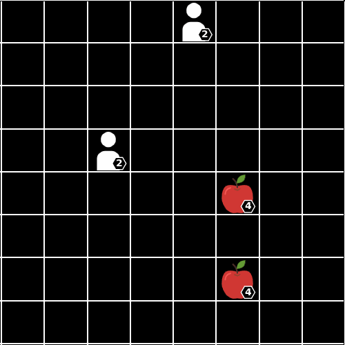

# # Level-Based Foraging Environment

        

We provide a JAX jit-able implementation of the [Level-Based Foraging](https://github.com/semitable/lb-foraging/tree/master)
environment.

The Level-Based Foraging (LBF) represents a mixed cooperative-competitive environment that emphasises coordination between agents. As illustrated above, agents are placed within a grid world and assigned different levels.

To collect food, the cumulative level of participating agents must meet or exceed the food's designated level. Agents receive points equivalent to the level of the collected food and their own level.

## Observation

The **observation** seen by the agent is a `NamedTuple` containing the following:

- `agents_view`: jax array (int32) of shape `(num_agents, num_obs_features)`, array representing the agent's view of other agents
    and food.

- `action_mask`: jax array (bool) of shape `(num_agents, 6)`, array specifying, for each agent,
    which action (noop, up, down, left, right, load) is legal.

- `step_count`: jax array (int32) of shape `()`, number of steps elapsed in the current episode.

## Action

The action space is a `MultiDiscreteArray` containing an integer value in `[0, 1, 2, 3, 4, 5]` for each
agent. Each agent can take one of five actions: noop (`0`), up (`1`), down (`2`), turn left (`3`), turn right (`4`), or pick up food (`5`).

The episode terminates under the following conditions:

- An invalid action is taken, or

- An agent collides with another agent.

## Reward

The reward is global and shared among the agents. It is equal to the number of shelves which were
delivered successfully during the time step (i.e., +1 for each shelf).

## Registered Versions 📖

- `LevelBasedForaging-v0`, a grid with 2 agents each with a field of view equal to the grid size (full observation case), with 2 food items and forcing the cooperation between agents.
