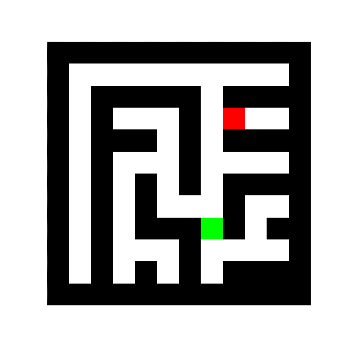

# Maze Environment

<p align="center">
        
</p>

We provide here a Jax JIT-able implementation of a 2D maze problem. The maze is a size-configurable 2D matrix where each cell represents either free space (white) or wall (black).

The goal is for the agent (green) to reach the single target cell (red). It is a sparse reward problem, where the agent recieves a reward of 0 at every step and a reward of 1 for reaching the target. The agent may choose to move one space up, right, down, or left: ("N", “E”, "S",  "W"). If the way is blocked by a wall, it will remain at the same position.

Each maze is randomly generated using a recursive division function. By default, a new maze, initial agent position and target position, are generated each time the environment is reset.

## Observation

As an observation, the agent has access to the current maze configuration in the array named `walls`. It also has access to its
current position `agent_position`, the target's `target_position`, the number of steps `step_count` elapsed in the current episode
and the action mask `action_mask`.
- `agent_position`: Position(row, col) (int32) each of shape (), agent position in the maze.
- `target_position`: Position(row, col) (int32) each of shape (), target position in the maze.
- `walls`: jax array (bool) of shape (n_rows, n_cols), indicates whether a grid cell is a wall.
- `step_count`: jax array (int32) of shape (), number of steps elapsed in the current episode.
- `action_mask`: jax array (bool) of shape (4,), binary values denoting whether each action is possible.

An example 5x5 observation `walls` array, is shown below. 1 represents a wall, and 0 represents free space.

```
[0, 1, 0, 0, 0],
[0, 1, 0, 1, 1],
[0, 1, 0, 0, 0],
[0, 0, 0, 1, 1],
[0, 0, 0, 0, 0]
```

## Action
The action space is a `DiscreteArray` of integer values in the range of [0, 3]. I.e. the agent can take one
of four actions: up (`0`), right (`1`), down (`2`), or left (`3`). If an invalid action is taken, or an action is
blocked by a wall, a no-op is performed and the agent's position remains unchanged.

## Reward
Maze is a sparse reward problem, where the agent recieves a reward of 0 at every step and a reward of 1 for reaching the target position.
An episode ends when the agent reaches the target position, or after a set number of steps (by default, this is twice the number of cells in the maze, i.e. `step_limit=2*n_rows*n_cols`).
