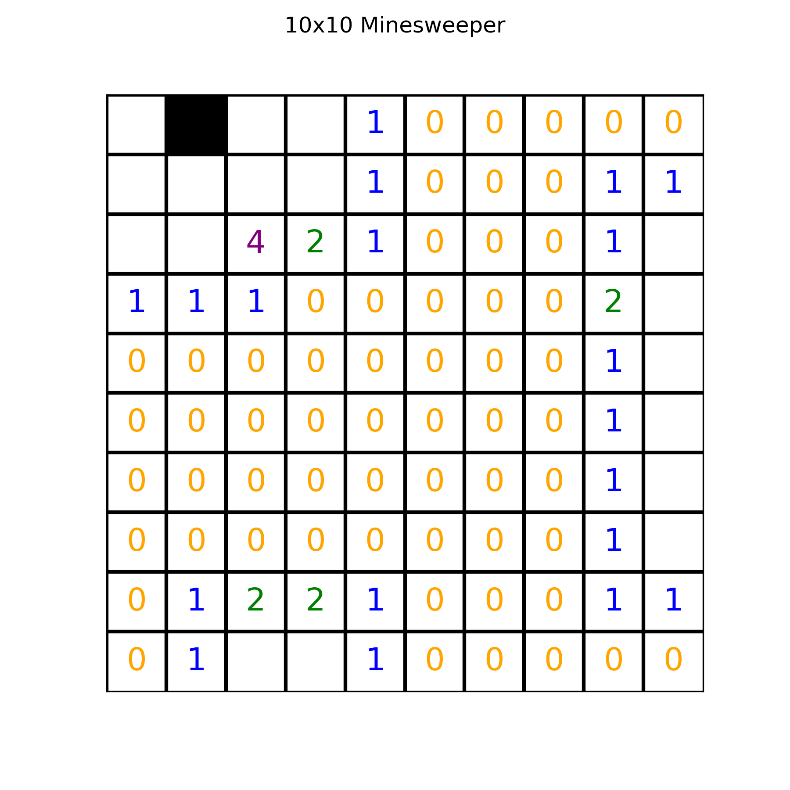

# Minesweeper Environment

        

We provide here a Jax JIT-able implementation of the game _Minesweeper_.

## Observation
The observation consists of a board, an action mask, a number of mines to locate, and a step count. The board is a grid whose entries are -1 if the square has not yet been explored, or otherwise the number of surrounding squares which have mines (between 0 and 8). The action mask indicates which squares have not yet been explored (this can also be determined from the board which will have an entry of -1 in all of these positions).

## Action
The action consists of specifying the coordinates of a square to explore. If either a mined square or an already explored square is selected, the episode terminates (the latter are termed "invalid actions").

Also, exploring a square will reveal only the contents of that square. This is slightly different from the game as usually implemented, which will automatically and recursively reveal neighbouring squares if there are no adjacent mines.

## Reward
The reward function is configurable, but by default is +1 for exploring a new square that does not contain a mine, and 0 otherwise (which also terminates the episode). The episode also terminates if the board is solved.

## Registered Versions 📖
- `Minesweeper-v0`, the classic [game](https://en.wikipedia.org/wiki/Minesweeper).
