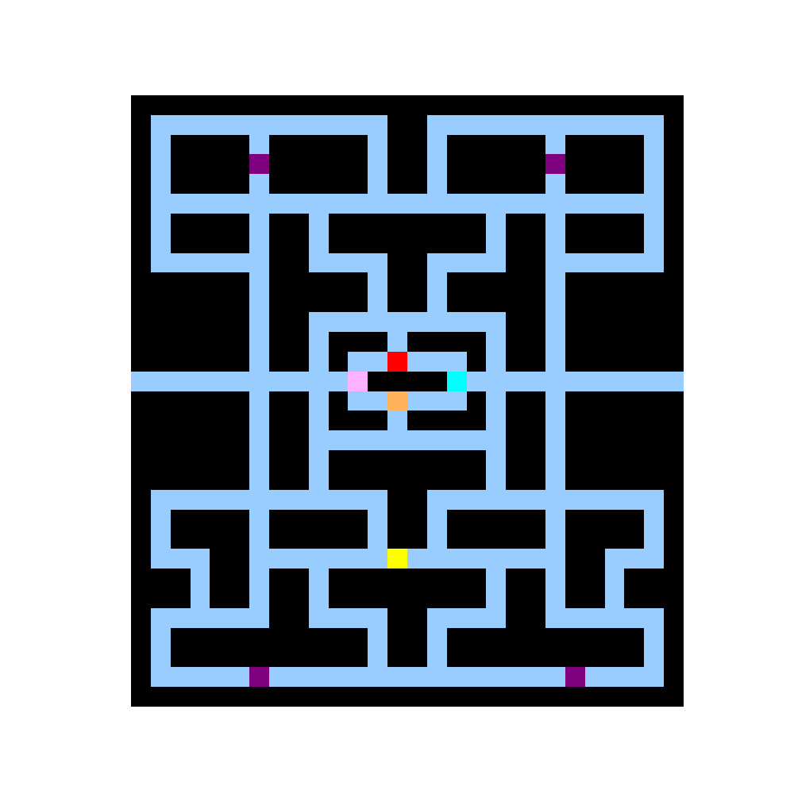

# PacMan Environment

<p align="center">
        
</p>

We provide here a minimal Jax JIT-able implementation of the game [PAC-MAN](https://pacman.com/en/history/). The game is played in a 2D matrix where a cell is a free space (black), a wall (dark blue), pacman (yellow) or a ghost.


The goal is for the agent (yellow) to collect all of the pellets (small pink blocks) on the map without touching any of the ghosts. The agent receives a reward of +10 when collecting a pellet for the first time and pellets are removed from the map after being collected.

The power-ups (large pink blocks) trigger a 'scatter mode' which changes the colour of the ghosts to dark blue for 30 in game steps. When the ghosts are in this state, the player can touch them which causes them to return to the center of the map. This gives a reward of +200 for each unique ghost.

The agent selects an action at each timestep (up, left, right, down, no-op) which determines the direction they wil travel for that step. However, even if an action is in an invalid direction it will still be taken as input and the player will remain stationary. If the no-op action is used the player will not stop but instead take the last action that was selected.

The game takes place on a fixed map and the same map is generated on each reset. The generator can be used to generate new maps based on an ASCII representation of the desired map.

## Observation
As an observation, the agent has access to the current maze configuration in the array named
`grid`. It also has access to its current position `player_locations`, the ghosts' locations
`ghost_locations`, the power-pellet locations `power_up_location`, the time left for the scatter state `frightened_state_time`, the pellet locations `pellet_locations` and the action
mask `action_mask`.

- `agent_position`: Position(row, col) (int32) each of shape `()`, agent position in the maze.

- `ghost_locations`: jax array (int32) of shape `(4,2)`, with the (y,x) coordinates of each ghost

- `power_up_locations`: jax array (int32) of shape `(4,2)`, with the (y,x) coordinates of each power-pellet

- `pellet_locations`: jax array (int32) of shape `(4,2)`, with the (y,x) coordinates of each pellet

- `frightened_state_time`: jax array (int32) of shape `()`, number of steps left of the scatter state.

- `action_mask`: jax array (bool) of shape `(5,)`, binary values denoting whether each action is
possible.
- `frightened_state_time`: (int32) tracking the number of steps for the scatter state.
- `score`: (int32) tracking the total points accumulated since the last reset.

An example 5x5 observation `grid` array, is shown below. 1 represents a wall, and 0 represents free
space.

```
[0, 1, 0, 0, 0],
[0, 1, 0, 1, 1],
[0, 1, 0, 0, 0],
[0, 0, 0, 1, 1],
[0, 0, 0, 0, 0]
```


## Action
The action space is a `DiscreteArray` of integer values in the range of [0, 4]. I.e. the agent can
take one of four actions: up (`0`), right (`1`), down (`2`), left (`3`) or no-op (`4`). If an invalid action is
taken, or an action is blocked by a wall, a no-op is performed and the agent's position remains
unchanged. Additionally if a no-op is performed the agent will use the last normal action used.


## Reward
PacMan is a dense reward setting, where the agent receives a reward of +10 for each pellet collected. The agent also recieve a reward of 20 for collecting a power pellet. The game ends when the agent has collected all 316 pellets on the map or touches a ghost.

Eating a ghost when scatter mode is enabled also awards +200 points but, points are only awarded the first time each unique ghost is eaten.


## Registered Versions 📖
- `PacMan-v0`, PacMan in a 31x28 map with simple grid observations.
