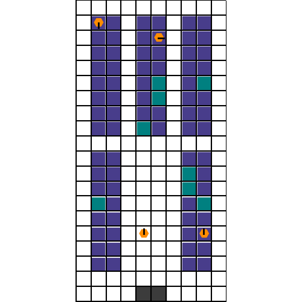

# RobotWarehouse Environment

        

We provide a JAX jit-able implementation of the [Robotic Warehouse](https://github.com/semitable/robotic-warehouse/tree/master)
environment.

The Robot Warehouse (RWARE) environment simulates a warehouse with robots moving and delivering requested goods. Real-world applications inspire the simulator, in which robots pick up shelves and deliver them to a workstation. Humans access the content of a shelf, and then robots can return them to empty shelf locations.

The goal is to successfully deliver as many requested shelves in a given time budget.

Once a shelf has been delivered, a new shelf is requested at random. Agents start each episode at random locations within the warehouse.

## Observation

The **observation** seen by the agent is a `NamedTuple` containing the following:

- `agents_view`: jax array (int32) of shape `(num_agents, num_obs_features)`, array representing the agent's view of other agents
    and shelves.

- `action_mask`: jax array (bool) of shape `(num_agents, 5)`, array specifying, for each agent,
    which action (noop, forward, left, right, toggle_load) is legal.

- `step_count`: jax array (int32) of shape `()`, number of steps elapsed in the current episode.

## Action

The action space is a `MultiDiscreteArray` containing an integer value in `[0, 1, 2, 3, 4]` for each
agent. Each agent can take one of five actions: noop (`0`), forward (`1`), turn left (`2`), turn right (`3`), or toggle_load (`4`).

The episode terminates under the following conditions:

- An invalid action is taken, or

- An agent collides with another agent.

## Reward

The reward is global and shared among the agents. It is equal to the number of shelves which were
delivered successfully during the time step (i.e., +1 for each shelf).

## Registered Versions 📖

- `RobotWarehouse-v0`, a warehouse with 4 agents each with a sensor range of 1, a warehouse floor with 2 shelf rows, 3 shelf columns, a column height of 8, and a shelf request queue of 8.
