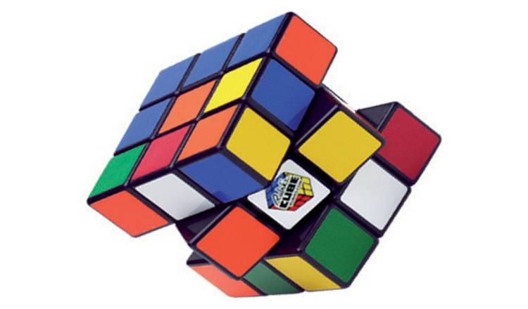

# Rubik's Cube Environment

        

We provide here a Jax JIT-able implementation of the _Rubik's cube_. The environment contains an implementation of the classic 3x3x3 cube by default, and configurably other sizes. The goal of the agent is to match all stickers on each face to a single colour. On resetting the environment the cube will be randomly scrambled with a configurable number of turns (by default 100).

## Observation
The observation is a dataclass containing a view of the current state of the cube, represented as an array of shape (6, cube_size, cube_size) of integers between 0 and 5 corresponding to the different sticker colours. The indices of the array specify the sticker position - first the face (in the order up, front, right, back, left, down) and then the row and column. Note that the orientation of each face is as follows:

UP: LEFT face on the left and BACK face pointing up

FRONT: LEFT face on the left and UP face pointing up

RIGHT: FRONT face on the left and UP face pointing up

BACK: RIGHT face on the left and UP face pointing up

LEFT: BACK face on the left and UP face pointing up

DOWN: LEFT face on the left and FRONT face pointing up

The observation also contains a step count.

## Action
An action consists of three pieces of information; firstly the face to turn, secondly the depth of the turn (possible depths are between 0 representing the outer layer and cube_size//2 representing the layer closest to the middle), and thirdly the amount (possible amounts are clockwise, anti-clockwise, or a half turn). The action is therefore a tuple of an index between 0 and 5, an index between 0 and cube_size//2, and an index between 0 and 2.

## Reward
The reward function is configurable, but by default is the fully sparse reward giving +1 for solving the cube and otherwise 0. The episode terminates if either the cube is solved or a configurable horizon (by default 200) is reached.

## Registered Versions 📖
- `RubiksCube-v0`, the classic [puzzle](https://en.wikipedia.org/wiki/Rubik%27s_Cube).
