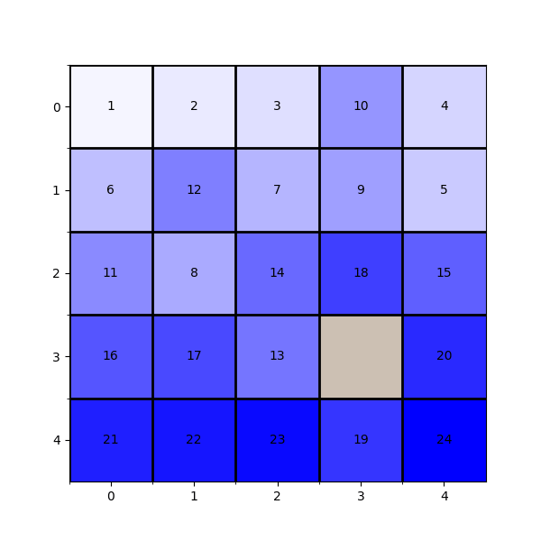

# Sliding Tile Puzzle Environment

<p align="center">
    
</p>

This is a Jax JIT-able implementation of the classic [Sliding Tile Puzzle game](https://en.wikipedia.org/wiki/Sliding_puzzle).

The Sliding Tile Puzzle game is a classic puzzle that challenges a player to slide (typically flat) pieces along certain routes (usually on a board) to establish a certain end-configuration. The pieces to be moved may consist of simple shapes, or they may be imprinted with colors, patterns, sections of a larger picture (like a jigsaw puzzle), numbers, or letters.

The puzzle is often 3×3, 4×4 or 5×5 in size and made up of square tiles that are slid into a square base, larger than the tiles by one tile space, in a specific large configuration. Tiles are moved/arranged by sliding an adjacent tile into a position occupied by the missing tile, which creates a new space. The sliding puzzle is mechanical and requires the use of no other equipment or tools.

## Observation

The observation in the Sliding Tile Puzzle game includes information about the puzzle, the position of the empty tile, and the action mask.

- `puzzle`: jax array (int32) of shape `(grid_size, grid_size)`, representing the current game state. Each element in the array corresponds to a puzzle tile. The tile represented by 0 is the empty tile.

  - Here is an example of a random observation of the game board:

        ```
        [[ 1 2 3 4]
         [ 5 6 7 8]
         [ 9 10 0 12]
         [ 13 14 15 11]]
        ```
  - In this array, the tile represented by 0 is the empty tile that can be moved.

- `empty_tile_position`: a tuple (int32) of shape `(2,)` representing the position of the empty tile in the grid. For example, (2, 2) would represent the third row and the third column in a zero-indexed grid.

- `action_mask`: jax array (bool) of shape `(4,)`, indicating which actions are valid in the current state of the environment. The actions include moving the empty tile up, right, down, or left. For example, an action mask `[True, False, True, False]` means that the valid actions are to move the empty tile upward or downward.

- `step_count`: jax array (int32) of shape `()`, current number of steps in the episode.

## Action

The action space is a `DiscreteArray` of integer values in `[0, 1, 2, 3]`. Specifically, these four actions correspond to moving the empty tile: up (0), right (1), down (2), or left (3).

## Reward

The reward could be either:

- **DenseRewardFn**: This reward function returns a dense reward based on the number of incorrectly placed tiles. Specifically, it returns the negative of the number of incorrectly placed tiles.

- **SparseRewardFn**: This reward function provides a sparse reward, only rewarding when the puzzle is solved.
The reward is 1 if the puzzle is solved, and 0 otherwise.

- **ImprovedDenseRewardFn**: This reward function provides a dense reward based on the difference of correctly placed tiles between the current state and the next state. The reward is positive for each newly correctly placed tile and negative for each newly incorrectly placed tile.

The goal in all cases is to solve the puzzle in a way that maximizes the reward.

## Registered Versions 📖

- `SlidingTilePuzzle-v0`, the Sliding Tile Puzzle with a grid size of 5x5.
