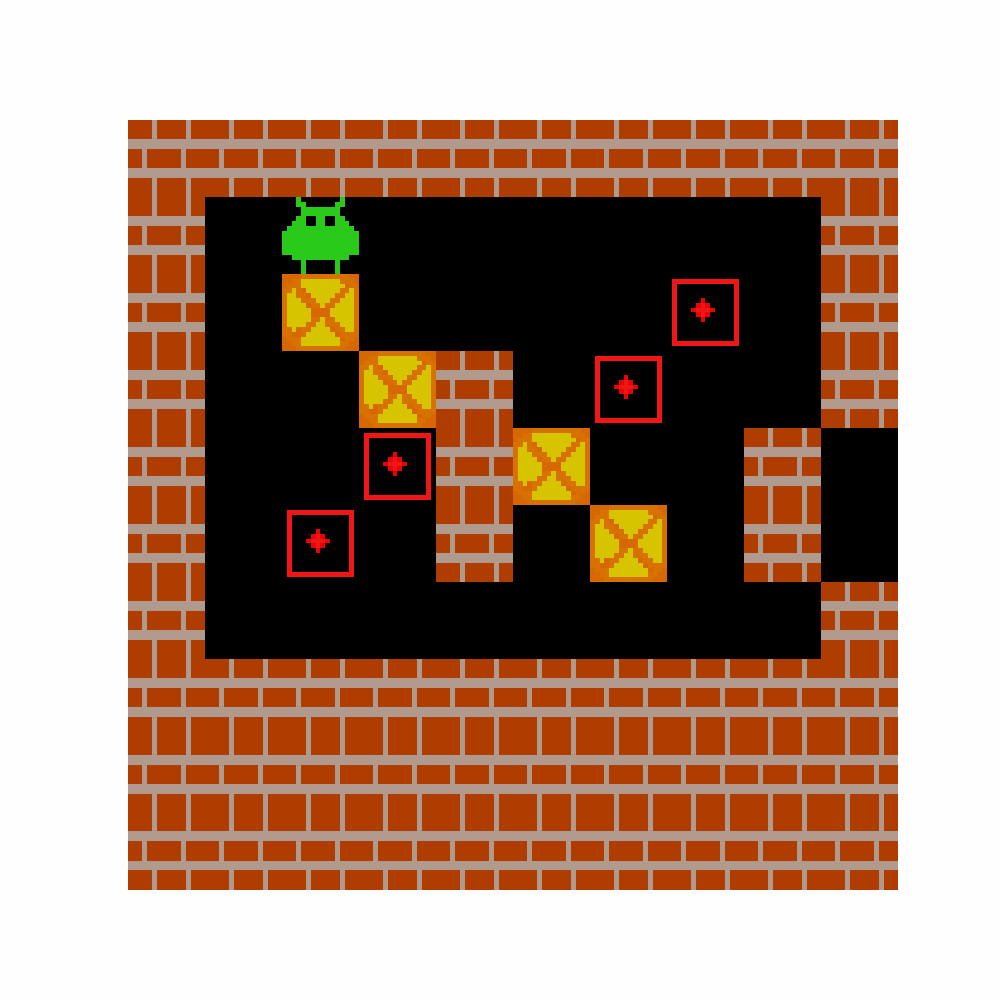

# Boxoban Environment 👾

        

This is a Jax implementation of the _Sokoban_ puzzle, a dynamic box-pushing environment where the agent's goal is to place all boxes on their targets. This version follows the rules from the DeepMind paper on [Imagination Augmented Agents](https://arxiv.org/abs/1707.06203), with levels based on the Boxoban dataset from [Guez et al., 2018](https://github.com/deepmind/boxoban-levels)[[1]](#ref1). The graphical assets were taken from [gym-sokoban](https://github.com/mpSchrader/gym-sokoban) by Schrader, a diverse Sokoban library implementing many versions of the game in the OpenAI gym framework [[2]](#ref2).

## Observation

- `grid`: An Array (uint8) of shape `(10, 10, 2)`. It represents the variable grid (containing movable objects: boxes and the agent) and the fixed grid (containing fixed objects: walls and targets).
- `step_count`: An Array (int32) of shape `()`, representing the current number of steps in the episode.

## Object Encodings

| Object       | Encoding |
|--------------|----------|
| Empty Space  | 0        |
| Wall         | 1        |
| Target       | 2        |
| Agent        | 3        |
| Box          | 4        |

## Actions

The agent's action space is an Array (int32) with potential values of `[0,1,2,3]` (corresponding to `[Up, Down, Left, Right]`). If the agent attempts to move into a wall, off the grid, or push a box into a wall or off the grid, the grid state remains unchanged; however, the step count is incremented by one. Chained box pushes are not allowed and will result in no action.

## Reward

The reward function comprises:
- `-0.1` for each step taken in the environment.
- `+1` for each box moved onto a target location and `-1` for each box moved off a target location.
- `+10` upon successful placement of all four boxes on their targets.

## Episode Termination

The episode concludes when:
- The step limit of 120 is reached.
- All 4 boxes are placed on targets (i.e., the problem is solved).

## Dataset

The Boxoban dataset offers a collection of puzzle levels. Each level features four boxes and four targets. The dataset has three levels of difficulty: 'unfiltered', 'medium', and 'hard'.

| Dataset Split | Number of Levels |
|---------------|------------------|
| Unfiltered (Training) | 900,000 |
| Unfiltered (Validation) | 100,000 |
| Unfiltered (Test) | 1,000 |
| Medium (Training) | 450,000 |
| Medium (Validation) | 50,000 |
| Hard | 3,332 |

The dataset generation procedure and more details can be found in Guez et al., 2018 <a href="#ref1">[1]</a>.

## Graphics

| Type             | Graphic                                                                                |
|------------------|----------------------------------------------------------------------------------------|
| Wall             |                       |
| Floor            |                     |
| Target    |            |
| Box on Target    |         |
| Box Off Target   |                |
| Agent Off Target |           |
| Agent On Target  |  |

## Registered Versions 📖

- `Sokoban-v0`: Sokoban game with levels generated using DeepMind Boxoban dataset (unfiltered train).

## References
<a id="ref1">[1]</a> Guez, A., Mirza, M., Gregor, K., Kabra, R., Racaniere, S., Weber, T., Raposo, D., Santoro, A., Orseau, L., Eccles, T., Wayne, G., Silver, D., Lillicrap, T., Valdes, V. (2018). An investigation of Model-free planning: boxoban levels. Available at [https://github.com/deepmind/boxoban-levels](https://github.com/deepmind/boxoban-levels)

<a id="ref2">[2]</a> Schrader, M. (2018). Gym-sokoban. Available at [https://github.com/mpSchrader/gym-sokoban](https://github.com/mpSchrader/gym-sokoban)
