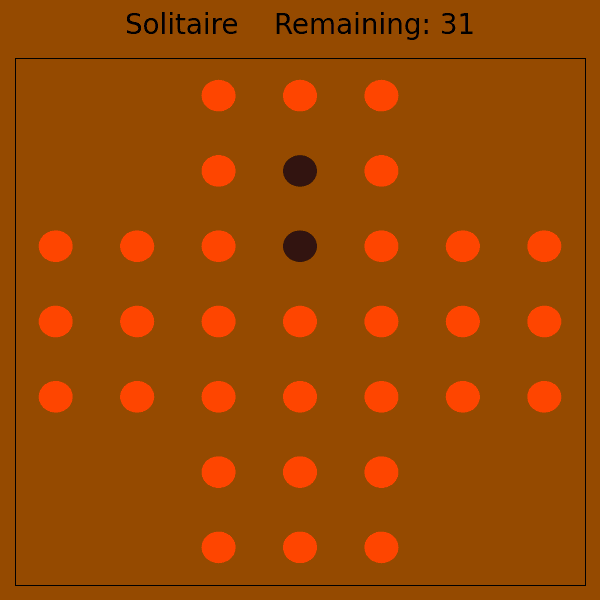

# Solitaire

<p align="center">
    
</p>

We provide here a Jax JIT-able implementation of [Peg Solitaire](https://en.wikipedia.org/wiki/Peg_solitaire).
Peg solitaire is a board game for one player involving movement of pegs on a board with holes. The standard game fills the entire board with pegs except for the central hole. The objective is, making valid moves, to empty the entire board except for a solitary peg in the central hole.
A valid move is to jump one peg over an adjacent peg into a whole two positions away and then remove the jumped peg. The game ends when no more moves are possible and is _solved_ when only a single peg remains (this cannot jump over any more pegs).

## Observation
The observation in the solitaire contains the placement of pegs on the board. Additionally, an action mask is included with the set of all valid moves in this position.

- `board`: jax array (bool) of shape `(board_size, board_size)`, representing the current board. Each position is either a 1 representing a peg or a 0 representing a hole.
    + Here is the starting board on a 5x5 grid:
        ```
        [[False,  True,  True,  True, False],
         [ True,  True,  True,  True,  True],
         [ True,  True, False,  True,  True],
         [ True,  True,  True,  True,  True],
         [False,  True,  True,  True, False]]
        ```
- `action_mask`: jax array (bool) of shape `(board_size, board_size, 4)`, indicating which actions are valid in the current state of the environment.

## Action
The action space is a `MultiDiscreteArray` with three integer values.

- The first is the row of the peg to move.
- The second is the column of the peg to move.
- The third is direction to move the peg: up (0), right (1), down (2), or left (3).

The move `[2, 4, 3]` in the starting position of a 5x5 board (above) would move the peg in middle of the rightmost column left into the centre and so the peg in row 2, column 4 would be removed.

## Reward
A reward of 1 is given for each move.


## Registered Versions 📖
- `Solitaire-v0`, a board size of 7x7 (classic English Solitaire).
