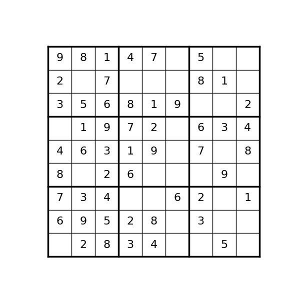

# Sudoku Environment

        

We provide here a Jax JIT-able implementation of the
[Sudoku](https://en.wikipedia.org/wiki/Sudoku) puzzle game.

## Observation
The observation given to the agent consists of:

- `board`: jax array (int32) of shape (9,9):
    empty cells are represented by -1, and filled cells are represented by 0-8.
- `action_mask`: jax array (bool) of shape (9,9,9):
    indicates which actions are valid.

## Action
The action space is a `MultiDiscreteArray` of integer values representing coordinates of the square
to explore and the digits to write in the cell, e.g. `[3, 6, 8]` for writing the digit `9`
the cell located on the third row and sixth column. 

## Reward
The reward is `1` at the end of the episode if the board is correctly solved, and `0` in every
other case.

## Registered Versions 📖
- `Sudoku-v0`, the classic [game](https://en.wikipedia.org/wiki/Sudoku) on
a 9x9 grid.
