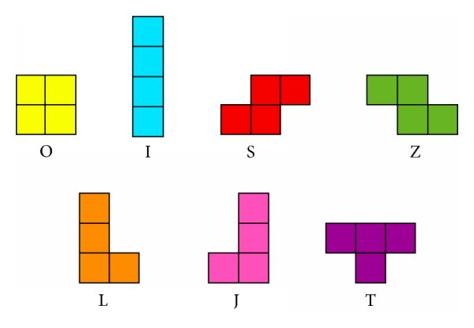

# Tetris Environment

<p align="center">
    
</p>

We provide here a Jax JIT-able implementation of the game Tetris. Tetris is a popular single-player game that is played on a 2D grid by fitting falling blocks of various Tetrominoes together to create horizontal lines without any gaps. As each line is completed, it disappears, and the player earns points. If the stack of blocks reaches the top of the game grid, the game ends. The objective of Tetris is to score as many points as possible before the game ends, by clearing as many lines as possible. Tetris consists of 7 types of Tetrominoes, which are shapes that represent the letters "I", "O", "S", "Z", "L", "J", and "T" as shown in the image below.
<p align="center">
    
</p>

## Observation
The observation in Tetris includes information about the grid, the Tetromino and the action mask.

- `grid`: Jax array (int32) of shape `(num_rows, num_cols)`, representing the current grid
    state. The grid is filled with zeros for the empty cells and with ones for the filled cells.

    + Here is an example of a random observation of the grid:
        ```
        [
            [0, 0, 0, 0, 0, 1],
            [0, 0, 0, 0, 1, 1],
            [0, 0, 0, 0, 1, 1],
            [0, 1, 0, 0, 1, 1],
            [0, 1, 1, 1, 0, 1],
            [0, 1, 0, 1, 1, 1],
            [1, 1, 0, 1, 1, 1],
        ]
        ```

- `tetromino`: Jax array (int32) of shape `(4, 4)`, where a value of 1 indicates a filled cell and a value of 0 indicates an empty cell.

    + Here is an example of an **I** tetromino:
        ```
        [
            [1, 0, 0, 0],
            [1, 0, 0, 0],
            [1, 0, 0, 0],
            [1, 0, 0, 0],
        ]
        ```
- `action_mask`: jax array (bool) of shape `(4, num_cols)`, indicating which actions are valid in the current state of the environment. Each row in the action mask corresponds to a Tetromino for a certain rotation (example: the first row for 0 degrees rotation, the second row for 90 degrees rotation, and so on).
    + Here is an example of an action mask that corresponds to the same grid and the tetromino examples:

        ```
        [
            [ True,  False,  True,  True, False, False],
            [ True,  True, False,  False,  False, False],
            [ True,  False,  True,  True, False, False],
            [ True,  True, False,  False,  False, False],
        ]
        ```
## Action

The action space in Tetris is represented as a `MultiDiscreteArray` of two integer values. The first integer value corresponds to the selected X-position where the Tetromino will be placed, and the second integer value represents the index for the rotation degree. The rotation degree index can take four possible values: 0 for "0 degrees", 1 for "90 degrees", 2 for "180 degrees", and 3 for "270 degrees". For example, an action of [7, 2] means placing the Tetromino in the seventh column with a rotation of 180 degrees.


## Reward
Dense: the reward is based on the number of lines cleared and the reward_list `[0, 40, 100, 300, 1200]`. If no lines are cleared, the reward is 0. As the number of cleared lines increases, so does the reward, with the maximum reward of 1200 being awarded for clearing four lines at once.


## Registered Versions 📖
- `Tetris-v0`, the default settings for tetris with a grid of size 20x10.
