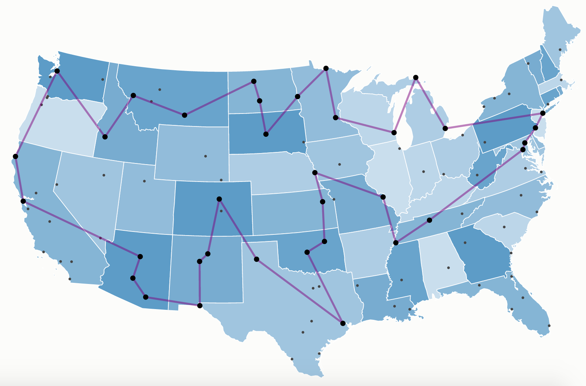

# Traveling Salesman Problem (TSP) Environment

<p align="center">
        
</p>

We provide here a Jax JIT-able implementation of the [traveling salesman
problem (TSP)](https://en.wikipedia.org/wiki/Travelling_salesman_problem).

TSP is a well-known combinatorial optimization problem. Given a set of
cities and the distances between them, the goal is to determine the
shortest route that visits each city exactly once and finishes in the
starting city. The problem is NP-complete, thus there is no known algorithm
both correct and fast (i.e., that runs in polynomial time) for any instance
of the problem.

When the environment is reset, a new problem instance is generated by
sampling coordinates (a pair for each city) from a uniform distribution
between 0 and 1. The number of cities is a parameter of the environment.
A trajectory terminates when no new cities can be visited or the last
action was invalid (i.e., the agent attempted to revisit a city).

## Observation
The observation given to the agent provides information on the problem layout, the visited/unvisited cities and
the current position of the agent as well as the starting point.

**Observation Spec**:

- **problem**: jax array (float32) of shape (problem_size, 2), shows an array of the coordinates of each city.
- **start_position**: jax array (int32), gives the identifier (index) of the first visited city.
- **position**: jax array (int32), gives the identifier (index) of the last visited city.
- **action_mask**: jax array (int8) of shape (problem_size,), array of binary values denoting visited/not_visited cities.

## Action
Action space is an `Array` where each index corresponds to the next city to visit.

```
action: [0, 0, 1, 0]  # Problem size of 4 cities, choosing the 3rd city
```

## Reward
The reward is 0 at every step except for the last step, where the reward is
the length of the path chosen by the agent.

## Registered Versions 📖
- `TSP50-v0`, TSP problem with 50 cities (randomly generated).
- `TSP100-v0`, TSP problem with 100 cities (randomly generated).
- `TSP150-v0`, TSP problem with 150 cities (randomly generated).
- `TSP200-v0`, TSP problem with 200 cities (randomly generated).
