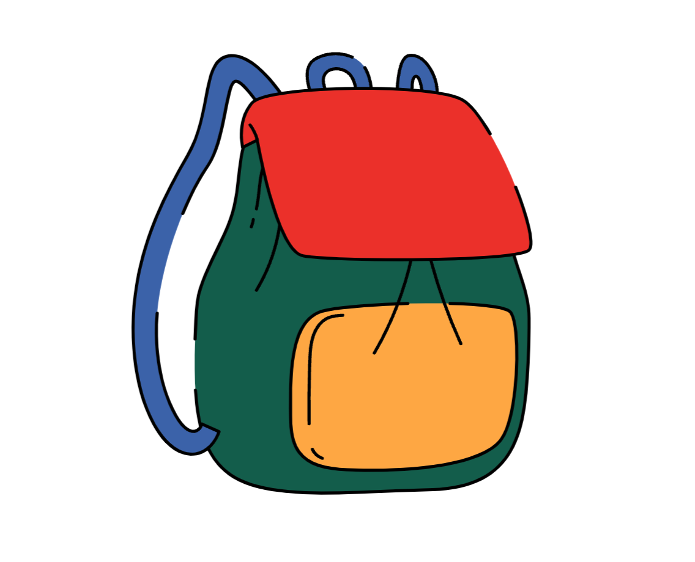

# Knapskack Environment

We provide here a Jax JIT-able implementation of the knapskack problem. The environment follows the design
of [1].

The knapsack problem is a famous problem in combinatorial optimization. The goal is to determine, given
a set of items, each with a weight and a value,
which items to include in a collection so that the total weight is less than or equal
to a given limit and the total value is as large as possible.

The decision problem form of the knapsack problem is NP-complete, thus there is no known
algorithm both correct and fast (polynomial-time) in all cases.

When the environment is reset, a new problem instance is generated, by sampling weights and values
from a uniform distribution between 0 and 1. The weight limit of the knapsack is a parameter of the
environment.
A trajectory terminates when no further item can be added to the knapsack, or that the last action
was invalid. The reward is 0 at every step, except at the last timestep when the reward is the
total value of the knapsack.

[1] [POMO: Policy Optimization with Multiple Optima for Reinforcement Learning](https://arxiv.org/abs/2010.16011).
