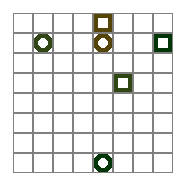

# PCB Grid Environment

We provide here an implementation of the PCB Grid environment using JAX.

The PCB Grid environment is a low-level abstraction of the Printed Circuit Board routing problem.
There are multiple agents spawned in a grid world (default: `(rows=12, cols=12)`) with each representing a wire/net that needs to
be connected to its own unique target/pin. The main goal of the environment is to connect each wire and to do so optimally.
Agents need to cooperate in order to allow each other to connect to their own targets.

The rewards given to each agent can be set but by default are as follows:

For each agent:
- The reward per timestep when not connected is -0.03
- The reward for an agent connecting to its target is 0.1
- The reward for an agent blocking itself is -0.1

An episode is regarded as complete when all agents have connected to their targets/pins
or no agents can make any further moves due to being blocked.



## Observation Space

The grid is a configurable size 2D matrix that represents pairs of points that need to be connected. Like in the PCB environment, the “head” of an agent has to connect to the “target”, leaving a “trace” behind it as it moves across the environment. Each head connects to only 1 target.

For example, on a 6x6 grid, the starting observation is shown below.

```java
[[ 0  0  0  0  0  0]
 [ 0  7 10  0  0  0]
 [ 0  0  0  6  3  0]
 [ 0  0  0  0  0  0]
 [ 0  9  0  0  0  0]
 [ 4  0  0  0  0  0]]
```


### Encoding

Heads are encoded starting from 4 in multiples of 3: 4, 7, 10, …

Targets are encoded starting from 3 in multiples of 3: 3, 6, 9, …

Traces appear in the location of the head once it moves, starting from 2 in multiples of 3: 2, 5, 8, …

Every group of 3 corresponds to 1 net: (2,3,4), (5,6,7), …

### Current Agent

The current agent is always encoded as (2,3,4).

The implementation shifts all other agents values to make the (2,3,4) values represent the current agent. This means that each subsequent agent id will always be the previous agent id's values shifted up by 3.

## Action Space

Each net can step in 4 cardinal directions, or take no action.


## Benchmark (Steps/s)

Using No GPU

### Batch Size: 1
| **Environment type \ board shape (n_rows, n_cols, n_agents)** | **(5, 5, 1)** | **(10, 10, 1)** | **(20, 20, 1)** | **(5, 5, 3)** | **(10, 10, 5)** | **(20, 20, 7)** |
|---------------------------------------------------------------|---------------|-----------------|-----------------|---------------|-----------------|-----------------|
| DeepMindEnvBenchmarkLoop                                      | 10,303         | 9,728            | 8,072            | 9,042          | 8,451            | 4,910            |
| JaxEnvBenchmarkLoop                                           | 9,992          | 9,636            | 9,159            | 9,888          | 9,022            | 4,826            |
| Non Jax PCB Grid Env                                          | 9,696          | 9,620            | 10,219           | 6,135          | 4,966            | 3,668            |


### Batch Size 10:
| Environment type \ board shape (n_rows, n_cols, n_agents) | (5, 5, 1) | (10, 10, 1) | (20, 20, 1) | (5, 5, 3) | (10, 10, 5) | (20, 20, 7) |
|-----------------------------------------------------------|-----------|-------------|-------------|-----------|-------------|-------------|
| JaxEnvironmentLoop                                        | 461,743    | 111,575      | 29,015       | 131,708    | 20,973       | 3,316        |


Using GPU

### Batch Size 1000:
| Environment type \ board shape (n_rows, n_cols, n_agents) | (5, 5, 1) | (10, 10, 1) | (20, 20, 1) | (5, 5, 3) | (10, 10, 5) | (20, 20, 7) |
|-----------------------------------------------------------|-----------|-------------|-------------|-----------|-------------|-------------|
| JaxEnvironmentLoop                                        | 2,933,149   | 2,446,476     | 1,351,949     | 1,258,591   | 592,582      | 222,688      |
