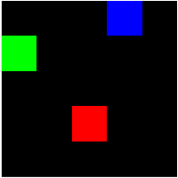

# Swap Environment

We provide here an implementation of the _two-colors_ domain from
[(Flennerhag et al., 2021)](https://arxiv.org/abs/2109.04504).
We call this environment _Swap_ since it is made of two targets whose colors swap every X steps.

The environment is a 5×5 grid world with one agent in green and two objects, a blue and a red
square. At each step, the agent can take an action to move either up, down,
left, or right and observes the position of each square and itself. Each position is encoded as
a pair of one-hot encodings, for the x and y coordinate respectively. If the agent reaches a
colored square, it obtains a reward of either +1 or −1 while the color is randomly moved to an
unoccupied location. Every 100 000 steps, the reward for each object flips. For all other
transitions, the agent obtains a reward of −0.04.

The two-colors domain is designed such that the central component determining how well a
memory-less agent adapts is its exploration. Our agents can only regulate exploration through
policy entropy. Thus, to converge on optimal task behavior, the agent must reduce policy entropy.
Once the task switches, the agent encounters what is effectively a novel task (due to it being
memory-less). To rapidly adapt the agent must first increase entropy in the policy to cover
the state-space. Once the agent observe rewarding behavior, it must then reduce entropy to
converge on task-optimal behavior.

